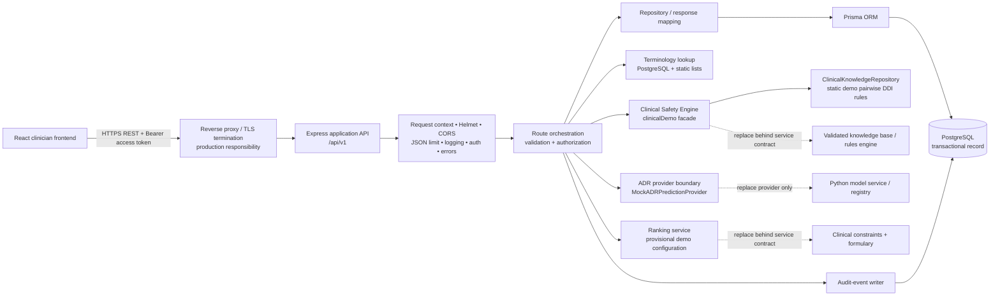
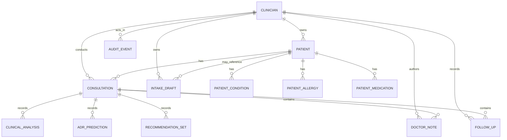
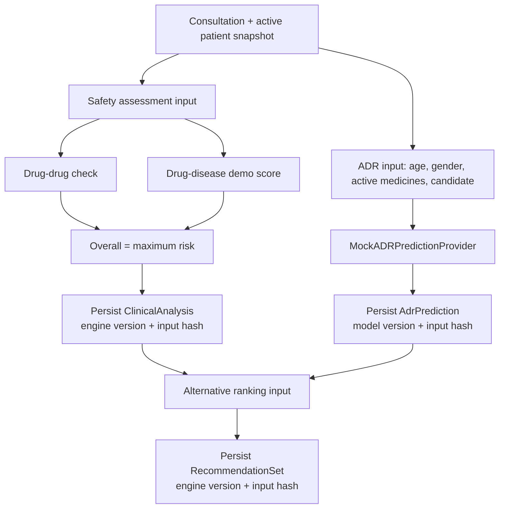
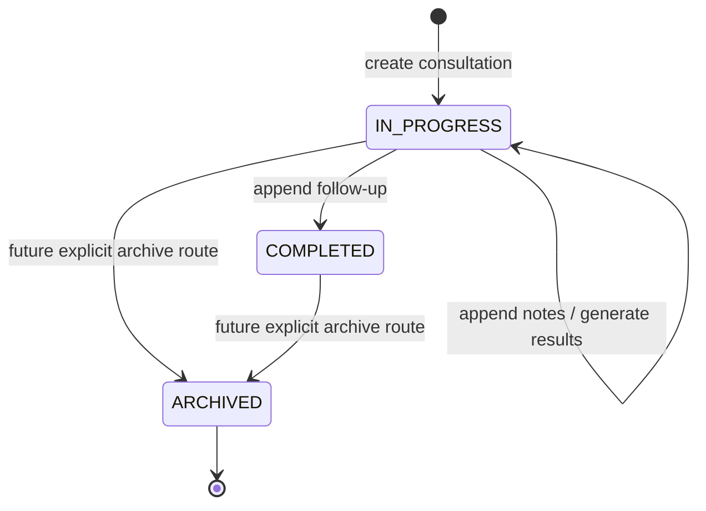
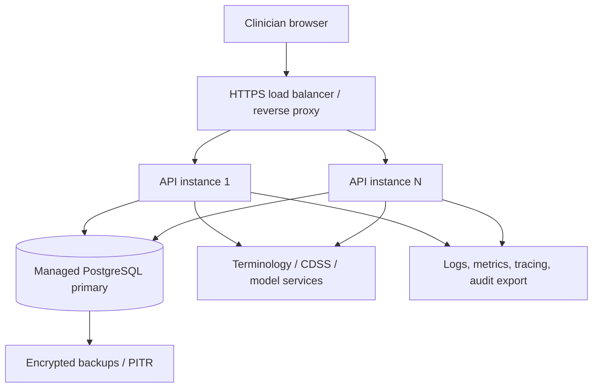
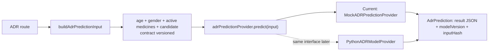

# VitaNexus-RX Backend Architecture Specification

**Document status:** Canonical backend architecture and implementation artifact  
**Applies to:** `server/`, `prisma/`, `.env.example`, and `docker-compose.yml`  
**Backend status:** Runnable demonstration REST API with PostgreSQL persistence and explicit clinical-provider boundaries  
**Clinical status:** Demonstration only. No generated clinical result is validated for patient care.

## 1. Purpose, scope, and non-negotiable boundary

VitaNexus-RX is a clinician-facing medication-safety workflow. The backend is the system of record for clinician identity, patient profiles, consultations, clinical-result snapshots, notes, follow-ups, terminology lookups, drafts, and audit events. It provides the stable API boundary between the React application and future governed clinical knowledge and ML services.

This document deliberately separates two things:

| Concern | Current implementation | Production target |
|---|---|---|
| Application API | Express 5 REST service | Horizontally scalable, versioned application API |
| Persistence | PostgreSQL 16 + Prisma | Managed PostgreSQL, backups, encryption, migration control |
| Identity | bcrypt password hashes + signed 15-minute JWT | Managed identity, MFA, refresh-token rotation/revocation, session governance |
| Clinical safety | Deterministic demonstration service | Validated, evidence-linked CDSS/rules service |
| ADR assessment | Deterministic demonstration function | Validated, monitored, governed ML inference service |
| Recommendations | Deterministic demo ranker | Formulary-aware, patient-specific recommendation/ranking service |
| Terminology | Seeded Indian OTC brand/generic records plus static lists | Versioned, curated clinical terminology/knowledge service |

The API must never claim that its demonstration outputs are clinically authoritative. Every current safety, ADR, and recommendation response carries `status: "DEMONSTRATION_ONLY"` and an explicit disclaimer. This is a safety property, not cosmetic metadata. Patient allergies remain clinician-recorded patient information; they are not an automated clinical-safety, ADR, or recommendation signal in the current scope.

## 2. Executable implementation inventory

| Path | Responsibility |
|---|---|
| `server/index.js` | Starts the HTTP listener and gracefully disconnects Prisma on `SIGINT`/`SIGTERM`. |
| `server/app.js` | Creates Express, installs middleware, defines every route, handles orchestration and transactions. |
| `server/config.js` | Reads runtime configuration and rejects missing production JWT secret. |
| `server/db.js` | Single Prisma client configuration. |
| `server/middleware.js` | Request correlation, JWT authentication, 404 mapping, error mapping. |
| `server/schemas.js` | Zod request-boundary validation and field limits. |
| `server/repository.js` | Prisma include graphs, input-to-database mapping, API response shaping. |
| `server/repositories/clinicalKnowledgeRepository.js` | Static demonstration pairwise-DDI data-access adapter; declares the absent drug-disease knowledge source. |
| `server/utils.js` | Stable hashing, public clinician projection, text normalization, enum mapping, audit helper. |
| `server/services/clinicalDemo.js` | Clinical orchestration facade; returns explicitly non-clinical safety, ADR, and recommendation results. |
| `server/services/adrPredictionProvider.js` | Versioned FAERS-oriented ADR input builder and `MockADRPredictionProvider`; replacement seam for a Python provider. |
| `server/services/recommendationRankingService.js` | Demonstration ranking boundary and versioned provisional configuration metadata. |
| `server/*.test.js`, `server/services/*.test.js` | API-envelope/auth smoke tests and clinical-demo contract tests. |
| `prisma/schema.prisma` | Declarative PostgreSQL data model. |
| `prisma/migrations/20260806000000_init/migration.sql` | Initial schema migration. |
| `prisma/seed.js` | Seeds the prototype Indian OTC terminology mapping. |
| `.env.example` | Required environment-variable names and local defaults. |
| `docker-compose.yml` | Local PostgreSQL 16 service with a persistent named volume. |

The API root is `/api/v1`. The listener defaults to `http://localhost:4000`; the React development origin is `http://localhost:5173`.

## 3. Logical architecture



### 3.1 Responsibility boundaries

| Layer | Owns | Must not own |
|---|---|---|
| Frontend | UI state, rendering, transient input state, presenting API errors | Trust decisions, authorization, durable clinical calculation, canonical persistence |
| Express routes | HTTP semantics, input validation, actor context, orchestration, response envelopes | Direct UI behavior, hidden clinical rules embedded in pages |
| Repository/mappers | Database object selection and public response projection | Authentication, clinical scoring |
| PostgreSQL | Durable transactional state, constraints, relationships, indexes | Business workflow, JSON contract conversion |
| Clinical adapters | A versioned result from a defined input snapshot | Authentication, patient ownership enforcement, arbitrary direct database access |
| Audit subsystem | Append-only record of material actions and request correlation | PHI-heavy request/response dumps or secrets |
| Terminology subsystem | Searchable normalized terms and mapping provenance | Guessing that unmatched free text is clinically normalized |

## 4. Runtime configuration and lifecycle

| Variable | Default/example | Meaning | Production rule |
|---|---|---|---|
| `NODE_ENV` | `development` | Runtime environment | Set to `production` in deploy environments. |
| `PORT` | `4000` | HTTP listener port | Inject by host/platform. |
| `DATABASE_URL` | Local PostgreSQL URL | Prisma PostgreSQL connection string | Store in secret manager; require TLS for remote DB. |
| `JWT_ACCESS_SECRET` | Development fallback exists | JWT signing/verification key | Mandatory in production, random, long, rotated. |
| `JWT_ACCESS_EXPIRES_IN` | `15m` | Access-token lifetime | Keep short; add refresh-token/session design before real use. |
| `CORS_ORIGIN` | `http://localhost:5173` | Comma-separated allowed browser origins | Exact production origin(s), never a permissive wildcard with credentials. |

Startup is `node server/index.js` (`npm run api:start`) or Node watch mode (`npm run dev:api`). `index.js` creates one Express app and closes the HTTP server before `prisma.$disconnect()` on process termination. Container orchestration must send `SIGTERM`, respect a drain interval, and only route traffic after readiness succeeds.

## 5. Full request pipeline

```mermaid
sequenceDiagram
  participant C as Client
  participant E as Express middleware
  participant R as Protected route
  participant V as Zod validator
  participant P as Prisma/PostgreSQL
  participant S as Clinical/terminology service
  participant A as Audit table

  C->>E: Request + optional X-Request-ID
  E->>E: Set/generate requestId; set response header
  E->>E: Helmet, CORS, JSON body limit, request log
  alt protected route
    E->>E: Verify Bearer JWT; set clinicianId and role
  end
  E->>R: Dispatch handler
  R->>V: Parse and normalize write input
  V-->>R: typed/validated input or Zod issue list
  R->>P: Tenant-scoped record read/write
  opt analysis, prediction, recommendation, or terminology
    R->>S: Build controlled input snapshot / lookup
    S-->>R: Versioned result
  end
  R->>P: Transactional persistence where required
  R->>A: Append audit metadata inside transaction when applicable
  R-->>C: { data, requestId } and HTTP status
```

Middleware order in the actual app is important:

1. Disable `X-Powered-By`.
2. Establish `req.requestId` from `X-Request-ID` or `crypto.randomUUID()` and set `X-Request-ID` on the response.
3. Apply Helmet headers.
4. Apply CORS with the configured allow-list and `credentials: false`.
5. Parse JSON with a 1 MB maximum body.
6. Use Morgan (`dev` outside production, `combined` in production).
7. Match health routes, then public auth routes, then authenticated routes.
8. Fall through to structured 404, then centralized error handler.

Routes that perform asynchronous work are wrapped by `asyncRoute`, which converts rejected promises into centralized errors. Write routes parse their request body before persistence. Database read/write logic uses Prisma; related write + audit operations use `prisma.$transaction`.

## 6. Identity, authentication, authorization, and tenant isolation

### 6.1 Current identity flow

```mermaid
sequenceDiagram
  participant U as Clinician
  participant API as API
  participant DB as Clinician table

  U->>API: POST /auth/register (profile + password)
  API->>API: Zod validation; bcrypt.hash(password, 12)
  API->>DB: Create clinician + audit event transaction
  API-->>U: public clinician + signed Bearer JWT

  U->>API: POST /auth/login (email + password)
  API->>DB: Find clinician by normalized email
  API->>API: bcrypt.compare
  API->>DB: Append login audit event
  API-->>U: public clinician + signed Bearer JWT

  U->>API: Protected request with Authorization: Bearer token
  API->>API: jwt.verify; set { clinicianId, role }
  API->>DB: Query constrained to clinicianId
```

Registration lowercases the email through Zod transformation, hashes the password with bcrypt cost 12, and writes `CLINICIAN_REGISTERED` in the same transaction. Login compares the stored hash and records `CLINICIAN_LOGGED_IN`. Password hashes are never projected by `publicClinician()`.

The JWT subject (`sub`) is the clinician UUID and its payload contains the clinician role. It is signed with `JWT_ACCESS_SECRET` and expires according to `JWT_ACCESS_EXPIRES_IN`. `authenticate` accepts only an `Authorization: Bearer <token>` header. Missing token returns `401 UNAUTHENTICATED`; failed verification returns `401 INVALID_TOKEN`.

`POST /auth/logout` is intentionally only client-token disposal plus an audit event. Stateless access JWTs cannot be revoked by this implementation. It is not a production-grade logout model.

### 6.2 Ownership enforcement

Patient reads call a shared `getPatient(client, clinicianId, patientId)` query with:

```text
patient.id = requested ID
AND patient.clinicianId = authenticated JWT subject
AND patient.deletedAt IS NULL
```

Consultation reads apply the clinician ID and require that the parent patient is not soft-deleted. A failure is intentionally returned as `404 NOT_FOUND`, rather than leaking existence with `403`, which helps prevent insecure direct object reference discovery. Drafts are scoped by the authenticated clinician and scope key. Terminology is authenticated but global in the current prototype.

The current role enum has `CLINICIAN` and `ADMIN`, but no role-based administrative routes exist. A future admin role must be enforced through explicit authorization middleware and audited policies; having a role claim alone grants nothing.

### 6.3 Authentication controls already present and required next

| Control | Current state | Required production strengthening |
|---|---|---|
| Password hashing | bcrypt cost 12 | Managed identity, breach-password screening, password reset, MFA. |
| Brute-force limit | 10 auth requests per 15 minutes | Per-account + per-IP controls, progressive delay, monitoring. |
| Access tokens | Signed JWT, default 15 minutes | Key rotation, issuer/audience claims, refresh sessions, revocation. |
| Transport | Host-dependent | TLS-only, HSTS at edge, secure cookie session strategy if cookies are used. |
| Clinician tenancy | Single owner ID on patient/consultation | Practice/organization tenancy, membership and delegation policy. |
| Secrets | `.env` values | Managed secret store, rotation, no secrets in images/logs. |

## 7. API conventions and error contract

### 7.1 Versioning and envelopes

All routes are versioned under `/api/v1`. Successful JSON responses use:

```json
{
  "data": { "...": "resource or result" },
  "requestId": "uuid-or-client-supplied-correlation-id"
}
```

Error responses use:

```json
{
  "error": {
    "code": "VALIDATION_ERROR",
    "message": "One or more fields are invalid.",
    "details": [{ "path": "frequency", "message": "..." }]
  },
  "requestId": "uuid-or-client-supplied-correlation-id"
}
```

The response `X-Request-ID` header mirrors the envelope `requestId`. Clients should retain it for support, audit reconciliation, and retries. Server logs should use the same ID but must not write raw passwords, tokens, or full patient payloads.

### 7.2 HTTP outcomes

| Status | Code/example | Meaning |
|---|---|---|
| 200 | normal GET, successful computation/update | Request completed. |
| 201 | patient, consultation, note, follow-up created | New durable resource created. |
| 204 | patient archived, draft deleted | Successful response with no body. |
| 401 | `UNAUTHENTICATED`, `INVALID_TOKEN`, `INVALID_CREDENTIALS` | Authentication missing, expired/invalid, or rejected. |
| 404 | `NOT_FOUND`, `ASSESSMENT_NOT_FOUND`, `PREDICTION_NOT_FOUND` | Route/resource unavailable; ownership failures use this too. |
| 409 | `DUPLICATE_RECORD`, `VERSION_CONFLICT` | Unique constraint or stale optimistic-concurrency version. |
| 422 | `VALIDATION_ERROR` | Zod rejected one or more input fields. |
| 429 | `RATE_LIMITED` | Authentication rate limit reached. |
| 500 | `INTERNAL_ERROR` | Sanitized unexpected error; detailed error is server-side only. |

### 7.3 Endpoint inventory

All entries except health/readiness require `Authorization: Bearer <accessToken>`.

| Method + path | Input/query | Success | Persistent effects / authorization |
|---|---|---|---|
| `GET /health` | none | service status and timestamp | Public; no DB dependency. |
| `GET /ready` | none | `{ status: "ready" }` | Public; executes `SELECT 1` against DB. |
| `POST /auth/register` | clinician profile and password | clinician + access token | New clinician and audit event. |
| `POST /auth/login` | email, password | clinician + access token | Login audit event. |
| `POST /auth/logout` | JWT | confirmation | Logout audit event; does not revoke token. |
| `GET /auth/me` | JWT | public clinician | Authenticated clinician only. |
| `GET /patients` | `q`, `status`, `limit` | patient summaries | Caller-owned, non-deleted patients only. |
| `POST /patients` | demographics and profile collections | full patient | Creates patient, nested profile items, audit. |
| `GET /patients/:patientId` | path UUID | full patient record | Caller-owned, non-deleted record only. |
| `PATCH /patients/:patientId` | partial fields + `expectedVersion` | full patient | Caller-owned; transaction + audit. |
| `DELETE /patients/:patientId` | path UUID | 204 | Soft-deletes patient, increments version, audit. |
| `PUT /patients/:patientId/conditions` | `{ items, expectedVersion? }` | full patient | Replaces collection transactionally, audit. |
| `PUT /patients/:patientId/allergies` | same pattern | full patient | Replaces collection transactionally, audit. |
| `PUT /patients/:patientId/medications` | same pattern | full patient | Replaces collection transactionally, audit. |
| `POST /patients/:patientId/consultations` | candidate prescription/indication | consultation | Caller-owned patient; creates visit + audit. |
| `GET /consultations/:consultationId` | path UUID | detailed consultation | Caller-owned consultation only. |
| `PATCH /consultations/:consultationId/notes` | `{ text }` | appended note | Caller-owned; append + audit. |
| `POST /consultations/:consultationId/clinical-safety-assessment` | none | saved safety result | Caller-owned; idempotent upsert per consultation/type/engine version. |
| `GET /consultations/:consultationId/clinical-safety-assessment` | none | latest matching safety result | 404 if no generated record. |
| `POST /consultations/:consultationId/adr-predictions` | none | saved ADR result | Caller-owned; idempotent per input hash/model version. |
| `GET /consultations/:consultationId/adr-prediction` | none | latest ADR result | 404 if none. Note singular path. |
| `POST /consultations/:consultationId/recommendations` | none | saved ranked alternatives | Caller-owned; idempotent by result input hash/engine version. |
| `GET /consultations/:consultationId/recommendations` | none | last saved alternatives | 404 if none. |
| `POST /consultations/:consultationId/follow-ups` | adverse-event payload | new follow-up | Appends follow-up; marks consultation `COMPLETED`; audit. |
| `GET /consultations/:consultationId/follow-ups` | none | newest-first follow-ups | Caller-owned consultation. |
| `GET /terminology/medications` | `q`, `limit` | medication mapping matches | Maximum `limit` 50; authenticated. |
| `GET /terminology/indications` | none | versioned static list | Authenticated. |
| `GET /terminology/conditions` | none | versioned static list | Authenticated. |
| `GET /terminology/adverse-events` | none | versioned static list | Authenticated. |
| `GET /patient-intake-drafts/:scope` | draft scope | saved draft | Scoped to authenticated clinician. |
| `PUT /patient-intake-drafts/:scope` | `payload`, `expectedVersion?` | upserted draft | Scoped optimistic concurrency. |
| `DELETE /patient-intake-drafts/:scope` | scope | 204 | Deletes only caller's matching draft. |

`GET /patients` is intentionally a summary endpoint: it only selects current consultation id/status/date and returns latest consultation plus count. It limits output to `min(requested limit or 50, 100)`. It does not yet implement cursor pagination, total count across pages, or an index optimized for full-text/large-scale search.

## 8. Request validation and canonicalization

Zod is the API write boundary. No direct `req.body` is persisted without schema parsing. All constrained string helpers trim whitespace, require a value when non-optional, and impose size bounds.

| Input | Current rules | Important behavior |
|---|---|---|
| Registration name | 1-120, ASCII-leading name pattern | Rejects unsupported characters; production should be Unicode-aware. |
| Email | RFC-style Zod email, max 254, trim + lowercase | DB has unique index. |
| Password | 8-128, letter + digit + special character | Hash only; never return/store plaintext. |
| Patient age | Coerced integer 0-130 | Future policy should use DOB where clinically needed. |
| Patient gender | required text, max 50 | Current free text; needs governed representation for clinical use. |
| Medication | generic required; brand/dosage/frequency/route optional; max 100 fields | Status is `active`, `on-hold`, or `discontinued`. |
| Condition | display required; code/duration/source optional | No authoritative terminology validation yet. |
| Allergy | display required; code/severity/reaction/source optional | No allergy reconciliation/verification state yet. |
| Consultation | indication + candidate generic + dosage mandatory | Frequency strictly `1d`, `2d`, `3d`, `1w`, `2w`, or `3w` (case-insensitive). |
| Note | trimmed text 1-10,000 | Each request appends a note. |
| Follow-up | event and severity required; duration 0-3,650 days | Event code and notes optional. |
| Draft | JSON record payload + optional positive version | Payload is intentionally flexible and must be treated as draft-only. |

The API normalizes medication statuses at the persistence edge:

```text
active        -> ACTIVE
on-hold       -> ON_HOLD
discontinued  -> DISCONTINUED
```

Responses map the enum back to lower-case/hyphenated frontend values. `normalizedText` trims and collapses whitespace for medication terminology query input. This does not normalize medication identity; a mapped `genericName` is still text in the prototype.

## 9. Database architecture

### 9.1 Entity relationship model



The Prisma datasource is PostgreSQL and every primary key is a UUID-string generated by Prisma. Patient `publicId` is a distinct, human-facing identifier. It must never be used as a surrogate for authorization or as the only immutable primary key.

### 9.2 Exact persisted model detail

| Model | Fields and constraints | Lifecycle/meaning |
|---|---|---|
| `Clinician` | UUID `id`; unique `email`; `passwordHash`; name/profile fields; `role`; timestamps | Account/actor. Password hash is private. |
| `Patient` | UUID `id`; unique `publicId`; `clinicianId`; name, age, gender; `version`; nullable `deletedAt`; timestamps | Clinician-owned longitudinal profile. `deletedAt` implements archival. |
| `PatientCondition` | UUID; patient FK; display/code/duration/source; `isActive`; timestamps | Current prototype profile item. Relation cascades on hard parent deletion. |
| `PatientAllergy` | UUID; patient FK; display/code/severity/reaction/source; `isActive`; timestamps | Allergy profile item; lacks structured reaction/onset/certainty. |
| `PatientMedication` | UUID; patient FK; brand/generic/dosage/frequency/route/source; enum status; timestamps | Medication reconciliation item. Generic is required free text. |
| `Consultation` | UUID; patient and clinician FKs; indication; candidate brand/generic; dose/frequency/route; enum status; version; timestamps | One visit/prescription context. Defaults `IN_PROGRESS`. |
| `ClinicalAnalysis` | UUID; consultation FK; `type`; JSON `result`; engineVersion; inputHash; timestamp | Versioned persisted safety result. Unique `(consultationId,type,engineVersion)`. |
| `AdrPrediction` | UUID; consultation FK; JSON result; modelVersion; inputHash; timestamp | Versioned prediction. Unique `(consultationId,modelVersion,inputHash)`. |
| `RecommendationSet` | UUID; consultation FK; JSON recommendations; engineVersion; inputHash; timestamp | Versioned ranked alternatives. Unique `(consultationId,engineVersion,inputHash)`. |
| `DoctorNote` | UUID; consultation FK; author FK; text; version; timestamps | Append-only in route behavior; current version remains 1 because no edit route. |
| `FollowUp` | UUID; consultation FK; author FK; adverse-event text/code; severity; durationDays; notes; timestamp | Append-only observed outcome. |
| `IntakeDraft` | UUID; clinician FK; nullable patient FK; scope; JSON payload; version; timestamps | Per-clinician `scope` unique draft. `patientId` is currently not populated by draft route. |
| `MedicationTerminology` | UUID; brand; generic; source; version; timestamp | Seeded searchable Indian OTC mapping. Unique brand+generic. |
| `AuditEvent` | UUID; nullable actor FK; action/entity type/entity ID/request ID; JSON metadata; timestamp | Application audit trail. Actor is set null if a clinician is hard-deleted. |

### 9.3 Enumerations

| Enum | Values | Current use |
|---|---|---|
| `UserRole` | `CLINICIAN`, `ADMIN` | JWT role and stored account role. |
| `ConsultationStatus` | `IN_PROGRESS`, `COMPLETED`, `ARCHIVED` | Follow-up creation changes status to `COMPLETED`. |
| `MedicationStatus` | `ACTIVE`, `ON_HOLD`, `DISCONTINUED` | Determines active medicines used by demo services. |

### 9.4 Referential actions, indexing, and implications

Patient-to-clinician and consultation-to-clinician/patient relations restrict hard deletion. Profile collections cascade when their patient is hard-deleted; analyses, predictions, recommendation sets, notes, and follow-ups cascade when their consultation is hard-deleted. In ordinary API behavior, patient deletion is soft, so child records remain intact.

Implemented indexes support clinician filtering, patient name lookup, active medication filtering, consultation history/status listing, note ordering, terminology brand lookup, and audit lookups. Important unique constraints enforce clinician email, public patient ID, draft scope, terminology mapping pairs, and current result idempotency keys.

The current `POST /patients` public-ID formula uses a per-clinician count plus a four-character UUID suffix. This reduces collisions but is not an auditable sequence allocator. Production should generate the displayed ID through a transactional sequence/identifier policy that handles concurrency, retention, and human readability.

### 9.5 Response projections

`patientResponse()` and `consultationResponse()` are a deliberate anti-leakage boundary. They project only the fields the frontend needs; they do not serialize password hashes, audit rows, deleted timestamp, raw internal foreign keys beyond necessary resource ownership links, or every database relation.

Patient responses include active conditions and allergies, all medications, and consultations ordered newest first. Consultation responses include the latest safety assessment matching `type === "SAFETY"`, newest ADR prediction, newest recommendation set, latest note, and newest-first follow-ups. This nested response is suitable for the prototype but should be split/paginated for large longitudinal records.

## 10. Transactions, concurrency, idempotency, and state change

### 10.1 Transactional operations

| Operation | Atomic work |
|---|---|
| Registration | Clinician insertion + registration audit event. |
| Patient create | Patient + profile collections + creation audit event. |
| Patient update | Parent/profile collection replacement + updated response read + audit event. |
| Profile collection replacement | Delete every existing child item, create supplied items, increment patient version, audit. |
| Patient archive | Set `deletedAt`, increment version, audit. |
| Consultation create | Consultation insert + audit. |
| Note append | Note insert + audit. |
| Safety generation | Upsert result snapshot + audit. |
| ADR generation | Upsert result snapshot + audit. |
| Recommendation generation | Upsert recommendation snapshot + audit. |
| Follow-up append | Follow-up insert + consultation completion + audit. |

The read-after-write inside collection replacement occurs in the same transaction, keeping the response consistent with the new collection and version. A transaction rollback prevents a material record change without its corresponding audit write when both occur in the same transaction.

### 10.2 Optimistic concurrency

`Patient.version` and `IntakeDraft.version` increment on mutating writes. Clients may send `expectedVersion`; if supplied and not equal to the current persisted version, the API returns `409 VERSION_CONFLICT`. The API accepts omission for backward compatibility, which means conflict protection is optional today. Production client integration should always send it on mutable resources and add equivalent consultation/note amendment semantics where edits become possible.

Current collection `PUT` operations replace the complete list. A stale client that omits `expectedVersion` can erase another writer's recent change. This is acceptable only for the controlled prototype; it must be closed before multi-user or real-data use.

### 10.3 Idempotency of generated results

Safety uses `(consultationId, type, engineVersion)` as an upsert key. ADR uses `(consultationId, modelVersion, inputHash)`. Recommendations use `(consultationId, engineVersion, inputHash)`. Input hashes are SHA-256 over JSON serialization of the controlled input structure.

This prevents duplicate rows for normal repeated requests but has limitations:

- `JSON.stringify` depends on object/key and array order, so input canonicalization must be strengthened before distributed clinical integrations.
- Safety's unique key does not include `inputHash`; re-running the same engine version overwrites the result snapshot if patient inputs changed.
- Result generation currently happens synchronously in the HTTP process; there is no job queue, retry policy, timeout/circuit breaker, or external-call isolation.
- There is no client-provided idempotency key for ordinary POST resource creation.

## 11. Clinical-safety, ADR, and recommendation orchestration

### 11.1 Current computation contract



The safety route loads the owned consultation plus its patient profile. The `clinicalDemo` facade evaluates the candidate separately against every **active** existing medication through `findPairwiseDrugInteraction(candidate, existing)`. It does not evaluate three-drug combinations. The only supplied static demonstration pairs are aspirin/warfarin, ibuprofen/warfarin, fluoxetine/tramadol, and clarithromycin/simvastatin; each matched finding records its source and data version. A non-match receives a hash-derived display placeholder, not evidence that no interaction exists.

Drug-disease knowledge is not integrated, so its current numeric value is an explicit development placeholder. Patient allergy information is intentionally not loaded into the clinical-safety snapshot, evaluated, or emitted as an automated result: no validated Drug-Allergy knowledge source is part of the current scope.

The ADR route calls `buildAdrPredictionInput`, which persists a SHA-256 input hash over only `contractVersion`, age, gender, active medication brand/generic entries, and the newly prescribed brand/generic entry. Conditions, allergies, and other disease history are excluded. `MockADRPredictionProvider` currently uses only age, active-medication count, and candidate generic text; gender is carried in the provider contract but unused by the placeholder. Its output contains provider name, model name/version, input contract version, timestamp, explicit development-placeholder status, and non-conformal uncertainty status.

Safety output includes `drugDrug`, `drugDisease`, `overall`, and legacy-named `conformalReliability`. It does not include `drugAllergy`. Despite that field name, the current reliability value is explicitly marked `DEVELOPMENT_PLACEHOLDER_NOT_CONFORMAL`: it is not calibrated confidence, a prediction interval, or conformal prediction. `drugDrug` also carries its display confidence/interval/reliability fields for the frontend shape, all with the same placeholder status. Recommendation output carries a provisional ranking configuration plus three static-candidate demonstration items. New two-component safety results use engine version `vitanexus-demo-rules-1.2.0`; active API projections strip `drugAllergy` from legacy JSON snapshots and flag `legacyFieldsOmitted: ["drugAllergy"]` without altering the stored historical JSON.

**Scope decision:** Patient allergy information is retained as clinician-recorded patient knowledge but is not currently used as an automated Drug-Allergy interaction signal, clinical-safety score, ADR prediction input, or recommendation-ranking input because no validated Drug-Allergy knowledge source is integrated into the current implementation.

The patient APIs continue to return active allergy display, severity, code, reaction, and source fields. The clinician intake and dashboard patient-profile views display this information as clinical history; the Clinical Safety Analysis view displays only Drug-Drug Analysis, Drug-Disease Analysis, and Overall Clinical Risk.

### 11.2 Result persistence and retrieval

The POST endpoints calculate, persist, audit, and return a result. GET endpoints never regenerate: they return the stored record or a specific 404. This preserves a history-consistent UI and separates “not generated/unavailable” from “low risk.”

Recommendations can currently generate safety/ADR in memory if their records do not already exist, but those fallback intermediate values are not automatically persisted. Production should require explicit, versioned prerequisite results or persist the full provenance graph atomically.

### 11.3 Production replacement contract

A production adapter must preserve these responsibilities:

| Requirement | Safety/rules service | ADR ML service | Recommendation service |
|---|---|---|---|
| Canonical input | Normalized medication, condition, and prescription snapshot; clinician-recorded allergies excluded | Approved feature contract with feature availability | Safety/ADR output versions + patient/formulary constraints; allergies excluded |
| Version | Knowledge/rule-set version and evidence release | Model, feature schema, calibration and explanation versions | Ranking engine and formulary/knowledge versions |
| Reproducibility | Input hash + exact evidence/rule IDs | Input hash + model artifact ID | All upstream result IDs/hashes |
| Output | Findings, severity/category, evidence/explanation, uncertainty | Probability/category, calibration/uncertainty, explanation status | Ranked alternatives, exclusions, rationale, uncertainty |
| Failure | Explicit unavailable/degraded/not-evaluated state | Explicit unavailable/unsupported-feature state | Explicit no-safe-alternative/partial-result state |
| Safety | Never silently substitute a numeric estimate | Never interpret model unavailable as low risk | Never recommend without hard exclusions and provenance |

No production engine should receive raw free-text-only clinical data when a canonical code is required. It must receive an immutable input snapshot, not independently read mutable patient rows after request authorization has completed.

## 12. Consultation workflow and persistence state



Generated clinical results do not currently alter `Consultation.status`. The frontend has richer internal stage notions (safety assessed, ADR assessed, recommendations ready, follow-up pending); these are inferred from existing stored records rather than persisted as enums. This avoids duplicate state today but needs an explicit workflow projection or event model before a multi-actor production workflow.

Follow-up is append-only in route behavior. It captures adverse event, optional code, severity, optional duration days, optional notes, author, and creation time; then sets the consultation to `COMPLETED` inside the same transaction. There is no follow-up correction/amendment path, seriousness/outcome field, or automated post-follow-up re-ranking endpoint yet.

Doctor notes are also append-only: `PATCH /consultations/:id/notes` creates a new row rather than overwriting an existing one. The non-standard PATCH verb is kept for frontend compatibility; future API versions should use `POST /notes` for append or document the semantic exception explicitly.

## 13. Terminology and data-governance boundary

The medication search API queries `MedicationTerminology.brand` and `.generic` case-insensitively after whitespace normalization. It returns an alphabetical bounded list. Seeded records represent a small Indian OTC brand-to-generic reference, including Crocin, Dolo 650, Combiflam, Disprin, Digene, Gelusil, ENO, Benadryl, Vicks Action 500, and Saridon.

Static indication, condition, and adverse-event endpoints expose small hard-coded arrays and a `2026.08` version label. These lists are useful to exercise frontend API integration but are not a clinical terminology server.

The required production terminology model must add at least:

- Code system, code, display, synonyms, language, active/inactive status, source license, release date, and provenance.
- Product/formulation/strength/route/ingredient relationships rather than a single generic text string.
- Deterministic mapping status: `verified`, `mapped`, `ambiguous`, `unmapped`, or `reconciliation_required`.
- Search ranking, pagination/cursor, source/version filtering, audit of normalization selection, and a safe manual-entry pathway.
- Controlled indication, condition, allergy, and adverse-event codes as well as medication codes.

An unmapped medication or condition must remain explicitly unmapped; neither the API nor clinical engine may silently treat arbitrary display text as a trusted normalized ingredient.

## 14. Audit, traceability, and privacy controls

`AuditEvent` stores actor ID, action, entity type, entity ID, request ID, optional non-sensitive metadata, and timestamp. The implemented actions include clinician registration/login/logout; patient creation/update/profile replacement/archive; consultation creation/note append; safety/ADR/recommendation generation; and follow-up append.

Audit rows are application-append-only: no API route exposes edit or deletion. That is not equivalent to tamper-proof audit. A production-grade audit design needs database privileges that deny application updates/deletes, immutable/WORM export or centralized audit sink, clock synchronization, retention/hold policies, and periodic integrity verification.

The audit metadata should contain versions/counts/correlation data, not plaintext passwords, JWTs, full clinical notes, full request bodies, or raw model features. Clinical result tables already preserve result JSON, versions, input hashes, and timestamps; production should also preserve request snapshot IDs, knowledge source IDs, consent/data-use basis where required, and clinician acknowledgement/override rationale.

PHI protections required before real data:

| Area | Required control |
|---|---|
| Transit | TLS at edge and between service tiers; secure certificate rotation. |
| At rest | Managed database encryption, encrypted backups, documented key management. |
| Access | Least privilege DB roles, tenant authorization, staff access review, break-glass process if applicable. |
| Logs | PHI minimization/redaction, controlled access, retention and deletion policy. |
| Backups | Encrypted point-in-time recovery, restoration drills, retention requirements. |
| Deletion/retention | Jurisdictional retention schedule, legal hold, account/archive semantics, verified deletion workflows. |
| Privacy | Data inventory, consent/legal basis, DPIA/privacy review where applicable. |

## 15. Security architecture

### 15.1 Present controls

- Helmet applies standard defensive HTTP headers.
- CORS is an explicit configured origin allow-list; browser credentials are disabled.
- JSON body size is capped at 1 MB.
- Auth endpoints are rate-limited.
- Passwords are bcrypt-hashed; public projections exclude hashes.
- Protected routes verify signed JWTs.
- Tenant-scoped patient/consultation reads reduce IDOR risk.
- Zod validates writes and limits field sizes.
- Errors are sanitized for 5xx responses; internal error details are server-side.
- Patient delete is soft-delete, preserving the relational record.

### 15.2 Gaps to close before production

| Gap | Required solution |
|---|---|
| Token revocation/refresh | Auth provider or session store with rotation, reuse detection, revoke-all ability. |
| Rate limiting scope | Shared distributed store; per-IP/account/device rules; WAF/edge protection. |
| CSRF | Required if changing to cookie credentials. |
| Authorization model | Organization/practice memberships, role/permission policy, data-sharing rules. |
| Input/output hardening | Content-type enforcement, parameter schemas, safe logging, response schema tests. |
| Secrets | Vault/KMS, rotation, environment isolation, secret scanning. |
| Dependencies | Automated vulnerability scanning, lock-file review, patch cadence, SBOM. |
| Database | TLS, restricted network, separate application/migration/read-only roles. |
| Abuse resilience | Request timeouts, payload quotas, circuit breakers, queue back-pressure. |
| Security assurance | Threat modeling, SAST/DAST, penetration testing, incident runbook. |

## 16. Readiness, observability, and operational behavior

`GET /health` only proves that the HTTP application can respond; it returns a timestamp and does not query the database. `GET /ready` performs `SELECT 1`, so it is the correct readiness gate for a deployment that requires database connectivity.

Morgan emits request logs. Prisma emits warnings/errors in development and errors in production. Unhandled expected route errors become a structured response. There is no metrics endpoint, tracing exporter, structured JSON logger, alerting, error tracker, latency SLO, or background-job monitor in the current implementation.

Production observability must correlate request ID across frontend, API, DB, CDSS, model serving, terminology, and audit pipeline. It should measure at minimum:

- Request count, error rate, latency percentile, response size, and rate-limit events by endpoint.
- Database pool use, query timing, migration status, connection errors, and backup/restore health.
- Authentication failures, authorization denials, suspicious access patterns, and audit-write failures.
- Clinical-service availability/latency, result-generation failures, model/knowledge versions, and degradation states.
- Model-data drift, missing feature rate, calibration/fairness monitoring, and human override patterns after clinical validation.

## 17. Deployment topology and database operations



Local development uses Docker Compose only for PostgreSQL 16, with database `vitanexus`, user `vitanexus`, and a named `vitanexus_postgres_data` volume. The application itself is run from Node. The standard local sequence is:

1. Copy `.env.example` to `.env`; replace the development JWT secret.
2. Start the database: `docker compose up -d`.
3. Generate Prisma client: `npm run db:generate`.
4. Apply a development migration: `npm run db:migrate -- --name <migration-name>`.
5. Seed terminology: `npm run db:seed`.
6. Run API: `npm run dev:api`.
7. Check `/api/v1/health` and `/api/v1/ready`.

In production, use `npm run db:deploy` for reviewed, immutable migrations; never run interactive development migrations from application instances. Take/verify backups before schema changes, deploy backward-compatible expand migrations before code that needs them, and use contract migrations only after old application versions have drained.

## 18. Testing and verification architecture

Current automated coverage uses Vitest and Supertest:

| Test file | Covered behavior |
|---|---|
| `server/health.test.js` | Health envelope/request ID, authentication requirement, structured 404. |
| `server/services/clinicalDemo.test.js` | Demo result labelling, deterministic DDI rule, ADR interval bounds, non-candidate ordered alternatives. |

Commands:

```text
npm run api:test
npm run lint
npm run build
npm run db:generate
npm run db:deploy
```

The existing API tests create an Express app but do not exercise database-backed routes against an isolated PostgreSQL test database. Add the following before claiming production readiness:

- Migration and seed integration tests against ephemeral PostgreSQL.
- Auth register/login/expiry/invalid-token/rate-limit tests.
- Ownership/IDOR tests for every resource route.
- Contract tests for every success/error schema and frontend integration.
- Concurrent patient/draft update tests that prove `VERSION_CONFLICT` behavior.
- Transaction rollback/audit consistency tests.
- Terminology mapping, unmapped/ambiguous value, and pagination tests.
- Clinical adapter contract fixtures, version snapshot/reproducibility tests, and failure/degraded-mode tests.
- Load, resilience, security, accessibility-facing error, backup-restore, and disaster-recovery tests.

## 19. Frontend integration contract

The frontend should replace browser-local persistence gradually through an API client layer, not by distributing `fetch` calls throughout pages. That client must attach access token/request ID, parse the common envelope, map `422.details` to form fields, retain the server version value, and distinguish unavailable clinical computation from a low-risk result.

| Frontend capability | Backend resource | Important integration rule |
|---|---|---|
| Register/login/session restore | `/auth/register`, `/auth/login`, `/auth/me` | Do not store plaintext passwords; safely store or manage short-lived session credentials. |
| Dashboard | `GET /patients?q=&status=&limit=` | Use summary endpoint, then load full patient lazily. |
| Patient intake/edit | patient POST/PATCH + profile collection PUTs | Send/refresh `expectedVersion`; preserve mapping source and original brand. |
| Medication autocomplete | `/terminology/medications?q=&limit=` | Display source/version and handle unmapped free text explicitly. |
| Consultation | `POST /patients/:id/consultations` | Persist candidate brand and generic together; use canonical IDs in future. |
| Safety | POST then GET safety endpoint | Persist/show engine version and demo disclaimer. |
| ADR | POST then GET singular ADR endpoint | Treat 404/service error as unavailable, not as zero risk. |
| Recommendations | POST then GET endpoint | Preserve original result set; do not overwrite local history. |
| Notes/follow-up | append routes | Treat responses as new events, then re-fetch/reconcile timeline. |
| Intake draft | draft GET/PUT/DELETE | Scope must be client-safe, URL-safe, and version-aware. |

## 20. Required evolution from prototype to clinical-capable platform

The following is an architectural backlog, not a claim that these capabilities exist now.

1. **Identity and tenancy:** introduce practice/organization, clinician membership, authorization policy, secure session lifecycle, MFA, recovery, and access review.
2. **Clinical data normalization:** replace age-only demographic model with governed demographics/DOB policy; add coded conditions, medications, allergies, route, dose units, start/end dates, pregnancy status, vitals, labs, renal/hepatic data, and reconciliation state where clinically required.
3. **Medication knowledge:** integrate validated and licensed drug/ingredient/product datasets, interaction evidence, contraindications, contraindicated combinations, and formulation-aware rules.
4. **Clinical result model:** use typed normalized finding tables plus immutable payload snapshots; preserve rule/evidence IDs, thresholds, explanations, result status, and clinician acknowledgement/override.
5. **ML lifecycle:** define dataset lineage, feature schema, model registry, validation protocol, calibration, bias/fairness review, monitoring, rollback, and human factors review.
6. **Workflow:** persist explicit stage events/state transitions, amendments, reconciliation ownership, and versioned post-follow-up recommendation results.
7. **Reliability:** move external computations into async job/queue infrastructure with retry classification, idempotency keys, deadlines, circuit breakers, and durable outbox events.
8. **Data protection:** complete security/privacy/regulatory review appropriate to deployment jurisdiction; implement encryption, retention, backups, incident response, and access governance.
9. **Operations:** CI/CD gates, schema migration policy, test database, observability platform, SLOs, alerting, capacity planning, disaster recovery drills.
10. **Clinical governance:** establish accountable clinical owners, data-license records, validation studies, change control, user training, and decision-support labeling policy.

## 21. Known implementation limits and precise interpretation

- The backend is implemented and runnable, but its database-backed behavior depends on PostgreSQL being available and migrations/seeding being applied.
- It is a single Express process; it has no message queue, cache, worker process, service discovery, or external clinical service yet.
- Demonstration outputs are deterministic but include generation timestamps; stable scores do not make them clinically valid.
- The demo rule set is deliberately tiny and must not be interpreted as comprehensive interaction coverage.
- Medication, condition, allergy, indication, and adverse-event fields remain mostly text, even where an optional code exists.
- Patient age is stored rather than date of birth; it becomes stale over time.
- Patient profile collection replacement physically deletes existing child rows, despite soft deletion of the patient. This is not sufficient longitudinal clinical reconciliation history.
- Patient delete is archive-only from the API, but the database schema's cascade behavior would apply if a privileged direct hard delete occurred.
- Consultation result JSON is flexible; no database-level JSON schema or response-schema validation exists.
- Safety GET chooses the first latest ordered safety analysis; current safety uniqueness makes that deterministic for one engine version, but multi-version retrieval needs explicit version query semantics.
- Recommendation generation may use transient fallback safety/ADR results; it does not force stored prerequisite records.
- Authentication rate limiting is process-local unless a distributed store is configured, so it is not sufficient across multiple instances.
- The plain JWT logout endpoint cannot invalidate an already-issued token.
- CORS/Helmet help browser/API hygiene but do not replace TLS, network isolation, authorization policy, or compliance controls.
- No production claim should be made until the clinical, security, privacy, operational, and regulatory gaps in this document are addressed and independently verified.

## 22. Architecture acceptance checklist

Use this checklist when assessing the backend rather than relying on visual UI behavior.

| Area | Demonstration artifact now | Required evidence before real deployment |
|---|---|---|
| API boundary | Express routes, common envelopes, request IDs | OpenAPI/JSON Schema, compatibility/version policy, contract CI. |
| Persistence | Prisma schema, migration, PostgreSQL compose file | Managed DB, encrypted backup/restore proof, migration runbook. |
| Auth | bcrypt + short JWT + rate limiter | Identity provider, MFA, rotation/revocation, security review. |
| Tenant access | Clinician-owned patient/consultation filters | Organization RBAC/ABAC tests, audited sharing/delegation. |
| Validation | Zod on every current write route | Clinical terminology and semantic validation, adversarial tests. |
| Audit | Action/entity/request ID entries | Immutable storage/exports, retention and integrity controls. |
| CDSS | Labelled deterministic demo adapter | Validated rules/evidence, clinical ownership, verification. |
| ADR | Labelled deterministic demo adapter | Governed model, performance/calibration/fairness monitoring. |
| Recommendations | Labelled deterministic demo ranker | Patient/formulary-aware validated constraints, hard exclusion tests. |
| Testing | Smoke + demo service contract tests | DB/e2e/security/load/DR testing in CI. |
| Operations | Health/readiness endpoints and logs | Metrics/traces/alerts/SLOs/on-call and incident response. |

---

This specification is intentionally paired with [FRONTEND_ARCHITECTURE_SPECIFICATION.md](./FRONTEND_ARCHITECTURE_SPECIFICATION.md). The frontend document defines the user workflow and consumption contract; this document defines the server authority, persistence model, endpoint semantics, security boundary, and the evidence required to evolve the demonstration backend responsibly.

## Appendix A. Complete implementation audit

This table is derived from the executable code after the architecture-alignment update. “Fully implemented” means implemented for the current demonstration scope, not clinically validated.

| Capability | Classification | Actual execution path and evidence |
|---|---|---|
| REST API, versioning, envelopes | FULLY IMPLEMENTED | `server/app.js` owns all `/api/v1` routes; `send()` returns `{ data, requestId }`; middleware returns structured errors. |
| Configuration and startup | FULLY IMPLEMENTED | `config.js`, `db.js`, `index.js`, `.env.example`, and Compose PostgreSQL are present. |
| Registration/login/JWT authentication | FULLY IMPLEMENTED | Route -> Zod -> bcrypt -> Prisma -> signed JWT; `authenticate` verifies subject/role. Logout is intentionally token disposal only. |
| Patient/consultation ownership isolation | FULLY IMPLEMENTED | Shared patient/consultation reads filter authenticated clinician and non-deleted patient; failure is 404. |
| Patient profile, visits, notes, follow-ups, drafts | FULLY IMPLEMENTED | Prisma relations, validated routes, transactions, version fields, append-only note/follow-up route behavior, and audit actions exist. |
| Audit recording | FULLY IMPLEMENTED | `audit()` writes actor/action/entity/request ID/metadata within material write transactions. It is application-append-only, not tamper-proof. |
| Prisma schema and initial migration | FULLY IMPLEMENTED | `schema.prisma` and matching initial SQL migration define all current tables, FKs, constraints, enums, and indexes. |
| Medication terminology + Indian OTC mapping | PARTIALLY IMPLEMENTED | `MedicationTerminology` is database-backed and seeded with ten prototype Indian OTC mappings; search is brand/generic substring lookup. No canonical ingredient/code system exists. |
| Drug normalization | PARTIALLY IMPLEMENTED | Brand and generic text are retained and carried to analysis; no canonical drug identifier, aliases, strengths/formulations, or RxNorm-equivalent normalization is implemented. |
| Pairwise DDI analysis | PARTIALLY IMPLEMENTED | POST safety route -> `clinicalSafetyAssessment` -> `findPairwiseDrugInteraction` for each active medication. Four static demo pairs exist; non-match risk is a labelled placeholder, not a real negative finding. |
| Drug-disease analysis | PLANNED/DESCRIBED BUT NOT IMPLEMENTED | No dataset/repository/rules exist. The returned numeric display field is explicitly a development placeholder. |
| Drug-allergy analysis | PLANNED/DESCRIBED BUT NOT IMPLEMENTED (intentionally deferred) | `PatientAllergy` remains persisted and visible as clinician-recorded information. No safety input, rule, score, result field, ADR feature, or ranking input uses it. |
| Clinical confidence / conformal prediction | PLANNED/DESCRIBED BUT NOT IMPLEMENTED | Hash-derived display values exist only for the prototype. They are marked `DEVELOPMENT_PLACEHOLDER_NOT_CONFORMAL`; no calibration, prediction interval, or conformal algorithm exists. |
| ADR Risk Prediction Model | PARTIALLY IMPLEMENTED | Route -> `buildAdrPredictionInput` -> `MockADRPredictionProvider` -> persisted `AdrPrediction`. There is no trained model or Python HTTP call. |
| ADR model reproducibility metadata | PARTIALLY IMPLEMENTED | Result JSON carries provider/model name/version, input-contract version, timestamp, placeholder uncertainty; table stores input hash and model version. There is no immutable model registry or feature snapshot table. |
| Confidence-aware ranking engine | PARTIALLY IMPLEMENTED | Separate ranking service and provisional config exist, but values/candidates are static demonstration placeholders and no candidate-specific safety/ADR/formulary evaluation exists. |
| Post-follow-up re-ranking | PLANNED/DESCRIBED BUT NOT IMPLEMENTED | Follow-ups persist and complete a consultation; no backend re-ranking job/endpoint is run. |
| External Python ML integration | NOT PRESENT | Provider seam is deliberately present; no Python service URL, client, timeout, authentication, or inference endpoint is implemented. |
| Validated DDI/disease/allergy knowledge data | NOT PRESENT | Current static DDI demo rules are not a validated knowledge source. |

## Appendix B. Repository and dataset architecture

| Data responsibility | Current data-access abstraction | Actual source | Version/status | Preprocessing and current limitation |
|---|---|---|---|---|
| Patient, consultation, notes, follow-up, audit | Prisma access in `app.js`; response/mapping helpers in `repository.js` | PostgreSQL | Schema migration `20260806000000_init` | ORM ownership filters and transactions exist; route/domain code is not yet split into controllers. |
| Drug terminology / Indian OTC mapping | Direct Prisma lookup in terminology route | `MedicationTerminology`, seeded by `prisma/seed.js` | `VitaNexus prototype OTC mapping`, `2026.08` | Query trim/collapses whitespace; DB search is case-insensitive substring. Brand/generic remain text, not canonical IDs. |
| Pairwise DDI | `findPairwiseDrugInteraction()` in `repositories/clinicalKnowledgeRepository.js` | In-memory Map of four static rules | `vitanexus-demo-ddi-2026.08`, `DEMONSTRATION_ONLY` | Lowercases and removes nonletters before sorted pair matching. No multi-drug, formulation, dose, or evidence source support. |
| Drug-disease | No repository because no source is integrated | None | `NOT_INTEGRATED` | The repository status constant communicates absence; clinical service must not claim a knowledge lookup occurred. |
| Drug-allergy | No repository because no source is integrated | None | Intentionally excluded from automated analysis | Patient allergies remain profile data only; no text matching or placeholder analysis occurs. |
| ADR data | `buildAdrPredictionInput()` and provider interface | In-memory mock provider | Input `vitanexus-adr-faers-input-1.0`; provider demo version `1.0.0` | Constructs only approved model features; no FAERS dataset/model artifact is bundled or called. |
| Alternatives/ranking candidates | `recommendationRankingService.js` | Static six-name array | `vitanexus-demo-ranking-1.0`, `DEMONSTRATION_ONLY` | Not tied to indication, formulary, or clinical eligibility. |

There are deliberately no empty `DrugDiseaseRepository` or `DrugAllergyRepository` classes. A named repository without an actual data source would obscure the audit finding. When a validated source is introduced, it should implement a narrow query interface and replace the `NOT_INTEGRATED` status—not require route rewrites.

## Appendix C. Clinical contracts and mock-to-real replacement

### C.1 Clinical safety contract

The safety endpoint passes an owned consultation and current active patient profile into `clinicalSafetyAssessment`. For a candidate C and active medicines A and B, it calls exactly `findPairwiseDrugInteraction(C, A)` and `findPairwiseDrugInteraction(C, B)`. It does not calculate A+B+C as a regimen-level interaction.

| Result component | Current origin | Meaning of values |
|---|---|---|
| `drugDrug.findings` | Static pairwise DDI Map | Matched pair risk/severity/explanation comes from a tiny demonstration rule source and includes source/version. |
| `drugDrug.riskPercentage` on no match | Hash-derived display score | Development placeholder; it is not evidence of no interaction. |
| `drugDrug.confidence`, interval, reliability | Hash-derived display values | Development placeholder; explicitly not conformal/calibrated. |
| `drugDisease` | No source | Risk/category are display placeholders; explanation states source absence. |
| `drugAllergy` | Not part of the active contract | No automated Drug-Allergy field, score, text matching, or finding is generated. |
| `overall` | Maximum of the current DDI and drug-disease component display scores | Development placeholder; not a governed clinical aggregation. |

### C.2 ADR provider contract and replacement



The current provider interface is `{ providerName, modelName, modelVersion, predict(input) }`; `predict` is asynchronous so a future Python HTTP provider can be substituted without changing the route or persistence call pattern. The input object is limited to age, gender, active current medications, and newly prescribed medication, with a contract version. Disease history is intentionally excluded.

`MockADRPredictionProvider` returns development placeholder risk/confidence/interval values. It includes `dataStatus`, `uncertaintyStatus`, provider/model metadata, input-contract version, and `generatedAt`. It does not call Python, load a trained model, use FAERS, calculate calibrated confidence, or implement conformal prediction.

A future Python provider must preserve the public result shape and return real provider/model artifact identifiers, calibrated uncertainty only when supported, model input validation failures separately from low risk, inference timeout/error semantics, and evidence/model-governance metadata. The API must never silently fall back from an unavailable real model to a “low risk” mock result.

### C.3 Conformal extension point

No conformal prediction implementation exists. The legacy response key `conformalReliability` survives because it is part of the frontend-facing prototype shape, but its `status` explicitly says it is a development placeholder and **not conformal**. A future conformal layer may populate this field only with method name/version, calibration-data version, coverage target, prediction set/interval, and clearly defined reliability semantics. It must not relabel model softmax confidence or a heuristic interval as conformal prediction.

### C.4 Ranking configuration and recommendation flow

`rankRecommendations()` is separate from safety analysis and ADR prediction. It receives their outputs and exports `recommendationRankingConfig` with `configId`, `weightsStatus: "PROVISIONAL"`, and this required governance statement: **“Ranking weights are provisional and will be reviewed/finalized after completion and evaluation of the ADR ML model.”**

Current flow is: consultation -> existing persisted safety/ADR results when available (otherwise transient demo fallbacks) -> static candidate list -> hash-derived demo score -> sorted top three -> persisted `RecommendationSet`. The recommendation input hash contains only the ranking-relevant safety fields, ADR fields, consultation ID, and candidate generic name; it excludes allergies and volatile generation timestamps. The POST response includes `ranking` metadata; each item includes `dataStatus: "DEVELOPMENT_PLACEHOLDER"`. It does **not** evaluate candidate-specific safety/ADR, indication suitability, formulary, contraindications, hard exclusions, or allergies.

The production flow is intentionally an extension point: indication-specific candidate source -> normalized candidate -> safety evaluation against patient profile -> ADR provider evaluation where approved -> uncertainty policy -> configurable ranking engine -> exclusions/rationale/versioned result set. Ranking configuration should be stored or supplied as governed data, not permanently encoded in the engine.

## Appendix D. Endpoint execution-path audit

| Endpoint | Route path to implementation | Persistence and error behavior |
|---|---|---|
| `POST /consultations/:id/clinical-safety-assessment` | `app.js` authenticates/owns consultation -> builds candidate + patient input -> `clinicalSafetyAssessment()` -> `clinicalKnowledgeRepository` pair lookup | Upserts `ClinicalAnalysis` by consultation/type/engine version and audits. Zod is not needed because body is empty; ownership/DB/handler errors use common envelope. |
| `GET /consultations/:id/clinical-safety-assessment` | `app.js` authenticates/owns consultation -> latest `SAFETY` analysis from include graph | Returns stored result or `404 ASSESSMENT_NOT_FOUND`; it does not recalculate. |
| `POST /consultations/:id/adr-predictions` | `app.js` authenticates/owns consultation -> `buildAdrPredictionInput()` -> `adrPredictionProvider.predict()` | Upserts `AdrPrediction` by consultation/model version/input hash; audits model/provider/input-contract metadata. No external Python call exists. |
| `GET /consultations/:id/adr-prediction` | `app.js` authenticates/owns consultation -> newest included prediction | Returns stored result or `404 PREDICTION_NOT_FOUND`; singular route name is intentional and retained. |
| `POST /consultations/:id/recommendations` | `app.js` authenticates/owns consultation -> stored or transient demo safety/ADR -> `rankRecommendations()` | Upserts `RecommendationSet`; audits ranking config/version status; POST returns ranking metadata. |
| `GET /consultations/:id/recommendations` | `app.js` authenticates/owns consultation -> newest included set | Returns the stored array with the current demonstration disclaimer and ranking configuration, or `404 RECOMMENDATIONS_NOT_FOUND`. Stored JSON does not preserve a historical ranking configuration snapshot separately. |

## Appendix E. Exact current implementation status for requested datasets

| Dataset/domain | Current status | Source/data layer | Real or mock | Future integration point |
|---|---|---|---|---|
| DDI | Partially implemented | Four static pairwise entries behind `clinicalKnowledgeRepository` | Demonstration-only static rules | Validated, licensed DDI knowledge repository with canonical ingredient IDs and evidence/version fields. |
| Drug-disease | Not integrated | None | Placeholder display only | Validated coded condition/contraindication knowledge provider. |
| Drug-allergy | Intentionally excluded from automated scope | None | No automated analysis | Future allergen/ingredient knowledge provider only after validated source and approved scope. |
| ADR | Partially implemented | Mock provider; no dataset or model artifact | Development placeholder | `PythonADRModelProvider` implementing the same async interface and FAERS-oriented feature contract. |
| Drug normalization | Partially implemented | Brand/generic strings in database and seeded terminology table | Basic text mapping, not canonical normalization | Coded canonical ingredient/product service with aliases/formulation/strength/route provenance. |
| Indian OTC mapping | Partially implemented | Ten seeded PostgreSQL mapping rows, duplicated from frontend prototype list | Static prototype mapping | Curated versioned Indian product/ingredient dataset with source and update governance. |
