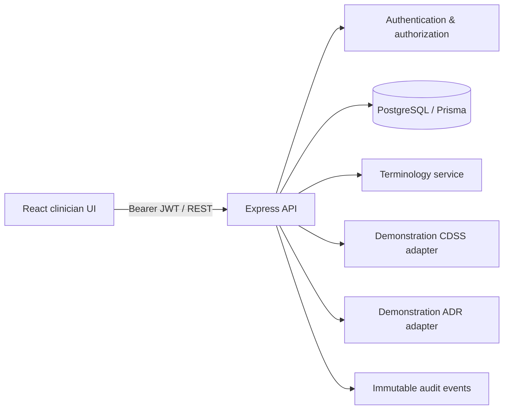

# VitaNexus-RX Backend Implementation Guide

> **Historical setup notice:** This guide predates the completed dataset and FAERS ML integration. Use [CURRENT_SYSTEM_ARCHITECTURE.md](CURRENT_SYSTEM_ARCHITECTURE.md) for authoritative behavior, [DATASET_INTEGRATION.md](DATASET_INTEGRATION.md) for source processing, and [../ml/README.md](../ml/README.md) for model training and serving. Sections below that describe demonstration-only services are retained only as implementation history.

## Status and scope

This repository now contains a runnable REST backend for the VitaNexus-RX clinician workflow. It uses Express, PostgreSQL, Prisma, Zod validation, bcrypt password hashing, and signed JWT access tokens. It is structured for a B.Tech/IEEE-style project demonstration and separates persistence, API orchestration, terminology, audit logging, and future clinical-engine integration.

Clinical safety, ADR prediction, and alternatives currently use **deterministic demonstration services**. Each response is labelled `DEMONSTRATION_ONLY`; it is not a validated clinical decision-support or medical-device system and must not be used for patient care.

## Run locally

1. Copy `.env.example` to `.env` and replace the JWT secret.
2. Start PostgreSQL: `docker compose up -d`.
3. Generate the client and create tables: `npm run db:generate`, then `npm run db:migrate -- --name init`.
4. Seed Indian OTC terminology: `npm run db:seed`.
5. Run the API: `npm run dev:api`.
6. Verify it at `GET http://localhost:4000/api/v1/health`.

The existing Vite client remains available through `npm run dev`. Its future API base URL should be `http://localhost:4000/api/v1`.

## Architecture



Patient records are clinician-scoped. Every patient and consultation lookup is filtered by the authenticated clinician, avoiding insecure direct object references. Patient deletion is a soft delete. Follow-ups and notes are appended instead of destructively overwritten. `expectedVersion` supports optimistic-concurrency protection for patient profile writes.

## Endpoint summary

All non-health endpoints use the `/api/v1` prefix. Protected endpoints require `Authorization: Bearer <accessToken>`.

| Area | Endpoints |
| --- | --- |
| Health | `GET /health`, `GET /ready` |
| Auth | `POST /auth/register`, `POST /auth/login`, `POST /auth/logout`, `GET /auth/me` |
| Patients | `GET/POST /patients`, `GET/PATCH/DELETE /patients/:patientId` |
| Profile collections | `PUT /patients/:patientId/conditions`, `/allergies`, `/medications` |
| Consultations | `POST /patients/:patientId/consultations`, `GET /consultations/:consultationId`, `PATCH /consultations/:consultationId/notes` |
| Results | `POST/GET /consultations/:consultationId/clinical-safety-assessment`, `/adr-predictions` (`GET` uses singular `/adr-prediction`), `/recommendations` |
| Follow-up | `POST/GET /consultations/:consultationId/follow-ups` |
| Terminology | `GET /terminology/medications?q=`, `/indications`, `/conditions`, `/adverse-events` |
| Drafts | `GET/PUT/DELETE /patient-intake-drafts/:scope` |

All success payloads have `{ data, requestId }`. Errors have `{ error: { code, message, details? }, requestId }`. Send an `X-Request-ID` header to supply your own correlation ID.

## Core request examples

```json
POST /api/v1/auth/register
{
  "name": "Dr Asha Mehta",
  "email": "asha@example.test",
  "password": "StrongPassword1!",
  "specialty": "General Medicine"
}
```

```json
POST /api/v1/patients
{
  "name": "Demo Patient",
  "age": 48,
  "gender": "Female",
  "conditions": [{ "display": "Hypertension", "duration": "4 years" }],
  "allergies": [],
  "medications": [{ "brand": "Crocin", "genericName": "Paracetamol (Acetaminophen)", "dosage": "500 mg", "frequency": "2d", "status": "active" }]
}
```

```json
POST /api/v1/patients/:patientId/consultations
{
  "indication": "Pain or fever",
  "candidateBrand": "Dolo 650",
  "candidateGeneric": "Paracetamol 650mg",
  "dosage": "650 mg",
  "frequency": "2d"
}
```

## Security measures included

- Passwords are salted and hashed with bcrypt; they are never returned in API payloads.
- JWT validation, clinician ownership filtering, rate limiting on authentication, body-size limits, Helmet security headers, CORS allow-list configuration, and error sanitization are enabled.
- Audit events record actor, action, entity, correlation ID, and non-sensitive metadata.
- Soft deletion and append-only clinical notes/follow-ups preserve a review trail.
- Runtime validation occurs at every write boundary through Zod.

## Deliberate project limitations before deployment

- Use a managed identity/session provider with rotating refresh tokens and token revocation for real deployment; this project’s logout is client-token disposal plus audit logging.
- Configure TLS, secrets management, database backups, encryption at rest, health monitoring, and a production CORS origin.
- Replace demonstration rule/model services with clinically validated, governed data and models; preserve model/rule versioning and input hashes.
- Conduct privacy, security, data-retention, fairness, clinical validation, and regulatory review before accepting any real patient data.

## Verification completed in this workspace

- `npx prisma generate` and `npx prisma validate` completed successfully.
- `npm run api:test` checks health, protected-route authorization, error envelopes, and deterministic clinical-service contracts.
- `npm run lint` and `npm run build` completed successfully.
- Docker is not installed in this workspace, so PostgreSQL migration, seeding, and database-backed endpoint smoke tests must be run after Docker Desktop or another PostgreSQL instance is available.
