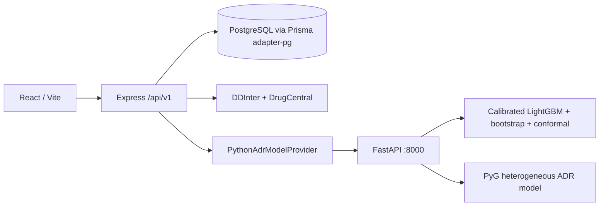

# VitaNexus-RX — Current System Architecture

**Status:** authoritative runtime reference

**Last verified:** 2026-08-24
**Actual knowledge engine:** `vitanexus-knowledge-2.2.0`

Older backend/frontend specifications are historical. This document describes the current code.

## Runtime topology

The Python service loads artifacts once at startup. Express propagates request IDs, uses a bounded timeout, validates responses with Zod, and persists the result JSON. It never converts missing ML into zero/LOW risk.

## Clinician workflow and routes

| Stage | React route/step | Persistence |
| --- | --- | --- |
| Patient / consultation | `/patients/new` | Patient and Consultation |
| Clinical Safety | `/patients/:patientId`, Clinical Safety | ClinicalAnalysis |
| Adverse Risk Assessment | `/patients/:patientId/consultations/:visitId/adr` | AdrPrediction |
| Recommendations | `/patients/:patientId`, Recommendations | RecommendationSet |
| Follow-up | PatientRecord follow-up step | FollowUp |

Authenticated direct links wait for session restoration before route guards run. Refreshing the ADR URL therefore reloads the persisted API result rather than redirecting to the dashboard or generating a random value.

## Input contracts

Consultation submission requires a selected DrugCentral result:

- `indication`
- `indicationId`
- `indicationSource = DrugCentral`
- `indicationDatasetVersion`

Express verifies the ID, source, version, and normalized display text against `DrugIndicationKnowledge`. Arbitrary typed text cannot be submitted as the selected indication.

The FAERS runtime vector uses only age, sex, canonical candidate drug, selected indication, and active/current medicines. Conditions remain in the DrugCentral P1 branch and are not fabricated as FAERS comorbidity history. Allergies are stored/displayed but remain outside automated analysis.

## Evidence branches

### Known evidence (P1)

- DDInter checks every candidate × active medicine pair and retains the worst relationship.
- DrugCentral checks every candidate × resolvable condition and retains the worst relationship.
- LOW, MODERATE, HIGH ordering dominates ML.
- No documented relationship is distinct from unresolved/not evaluated.
- Complete evidence precedes incomplete evidence within a tier.
- A HIGH candidate can never be rescued by favorable ML.

### FAERS learned evidence

The LightGBM task is:

> Probability that a FAERS adverse-event report for this context belongs to the serious-outcome class.

It is not the probability that an exposed patient experiences any ADR. The point probability is isotonic-calibrated. Twenty bootstrap replicas are configured in full mode and produce a 90% model-uncertainty interval; the upper bound is P2. Split conformal uses 2025Q4 and target coverage 0.90; its prediction set is P3 on exact P1/P2 ties.

The HGNN predicts specific MedDRA PT associations. Its report→ADR targets never enter encoder edges. HGNN output is explanatory only and is not another ranking weight.

### Laptop-safe training architecture

The full LightGBM training path is benchmark-gated and resumable. SHA-256 identities bind checkpoints to the immutable processed cohort, manifest, quality audit, pipeline version, and configuration. A development-only vocabulary encodes one disk-backed CSR representation that is reused across temporal stages. Tuning uses a deterministic quarter/class-representative development subset, while the selected final model always fits every 2022Q1–2025Q2 row. Scalable full-development baselines are Prior Dummy, SGD logistic classification, Complement Naive Bayes, and the selected LightGBM under the same 2025Q1–Q2 validation.

Bootstrap resampling remains at CASEID level but is represented by deterministic multiplicity/sample-weight vectors; feature rows are never duplicated. Every tuning model, baseline, final model, calibration object, and bootstrap replica is atomically checkpointed under local AppData by default, avoiding OneDrive locks and sync overhead. Partial full artifacts remain isolated from runtime smoke artifacts until all stages finish. `npm run ml:benchmark` reports measured RAM/timing and projected full cost; `npm run ml:status` reports resumable stage and replica completion.

### Deterministic ranking

The ranking engine is `vitanexus-lexicographic-p1-p2-p3-1.0.0`:

1. P1 tier and evidence completeness.
2. Presence of valid ML (missing output is never zero).
3. Lower bootstrap upper bound.
4. Conformal singleton non-serious, ambiguous set, singleton serious, invalid/empty.
5. Canonical drug name.

Rule-based “Why this rank?” text is stored with each candidate. No LLM or random score participates.

## APIs

Python:

- `GET /health`
- `POST /v1/predict`
- `POST /v1/predict-batch`

Express:

- `POST/GET /api/v1/consultations/:id/clinical-safety-assessment`
- `POST/GET /api/v1/consultations/:id/adr-predictions`
- legacy-compatible `GET .../adr-prediction`
- `POST/GET /api/v1/consultations/:id/recommendations`

The ADR page implements LOADING, SUCCESS, DEGRADED, UNAVAILABLE, and FAILED states. It displays calibrated probability, interval, conservative upper bound, conformal set, top ADRs, feature coverage, versions, data window, and FAERS limitations.

## Persistence/version invalidation

`AdrPrediction` stores result JSON, model version, deterministic input hash, and timestamp. `RecommendationSet` stores candidate snapshots and an engine version composed from known-evidence, ranking, and ML versions. Its input hash includes indication provenance, medicines, conditions, known evidence, candidate results, ML feature coverage, and all model versions. Artifact/model changes therefore create a new reproducible snapshot.

`20260824093000_add_consultation_indication_provenance` adds nullable provenance fields for legacy compatibility; all new API submissions require them. No database reset or historical migration deletion is used.

## Failure and security behavior

- `ML_UNAVAILABLE`, `INFERENCE_FAILED`, `OUT_OF_VOCABULARY`, and `DEGRADED_COVERAGE` are explicit.
- Fast artifacts include `-fast-smoke` versions and always render DEGRADED; they are not final models.
- Express logs normal request metadata, not full clinical payloads.
- Patient/consultation queries remain clinician-scoped.
- The FastAPI service is internal infrastructure and should bind to loopback/private networking.

## Scientific limitations

FAERS is a spontaneous-reporting system with reporting and selection bias and no exposed-population denominator. Serious-outcome estimates are conditional on the learned reporting task. Specific ADR scores are not incidence or severity. No documented interaction is not proof of safety. Allergy automation and online feedback retraining are outside current scope.
