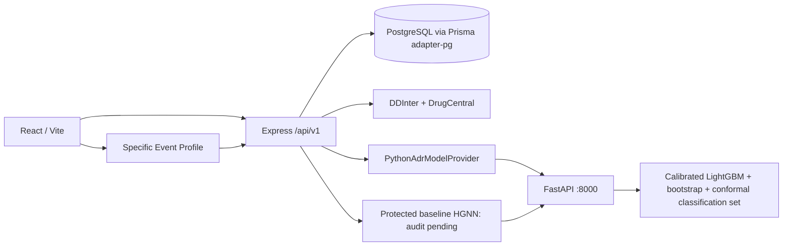

# VitaNexus-RX — Current System Architecture

**Status:** authoritative runtime reference

**Last verified:** 2026-09-15
**Actual knowledge engine:** `vitanexus-knowledge-2.5.0`

Older backend/frontend specifications are historical. This document describes the current code.

## Runtime topology

The Python service loads artifacts once at startup. Express propagates request IDs, uses a bounded timeout, validates responses with Zod, and persists the result JSON. It never converts missing ML into zero/LOW risk.

## Clinician workflow and routes

| Stage | React route/step | Persistence |
| --- | --- | --- |
| Patient / consultation | `/patients/new` | Patient and Consultation |
| Clinical Safety | `/patients/:patientId`, Clinical Safety | ClinicalAnalysis |
| Adverse Risk Assessment | `/patients/:patientId/consultations/:visitId/adr` | AdrPrediction |
| Specific Event Profile | `/patients/:patientId/consultations/:visitId/adverse-event-risks` | HgnnEventPrediction |
| Recommendations | `/patients/:patientId`, Recommendations | RecommendationSet |
| Follow-up | PatientRecord follow-up step | FollowUp |

Authenticated direct links wait for session restoration before route guards run. Refreshing the ADR URL therefore reloads the persisted API result rather than redirecting to the dashboard or generating a random value.

## Input contracts

Consultation submission requires a selected DrugCentral result:

- `indication`
- `indicationId`
- `indicationSource = DrugCentral`
- `indicationDatasetVersion`

Express verifies the ID, source, version, and normalized display text against `DrugIndicationKnowledge`. Arbitrary typed text cannot be submitted as the selected indication.

The FAERS runtime vector uses only age, sex, canonical candidate drug, selected indication, and active/current medicines. Conditions are evaluated through DrugCentral evidence and are not fabricated as FAERS comorbidity history. Allergies are stored/displayed clinician-reference information and remain outside automated analysis and ranking.

## Evidence branches

### Known evidence and safety gates

- DDInter checks every candidate × active medicine pair and retains the worst relationship.
- DrugCentral checks every candidate × resolvable condition and retains the worst relationship.
- LOW, MODERATE, HIGH ordering dominates ML.
- No documented relationship is distinct from unresolved/not evaluated.
- Complete evidence precedes incomplete evidence within a tier.
- A HIGH candidate can never be rescued by favorable ML.

### FAERS learned evidence

The LightGBM task is:

> Probability that a FAERS adverse-event report for this context belongs to the serious-outcome class.

It is not the probability that an exposed patient experiences any ADR. The point probability is isotonic-calibrated. Twenty bootstrap replicas are configured in full mode and produce a model-uncertainty range; the conservative upper bootstrap bound is the uncertainty-adjusted LightGBM risk used in ranking. Split conformal uses 2025Q4 and target coverage 0.90. Its output is a classification prediction set, not a probability-confidence interval and not an independent ranking weight.

HGNN-specific event-label scoring is served through an independent supplementary path. FastAPI loads the hash-verified protected epoch-20 selection checkpoint and its ordered 100-label vocabulary once, constructs the same heterogeneous graph and features used in training, and returns deterministic top-K sigmoid model scores. The UI labels the model **Baseline** and **Audit Pending** and explicitly states that scores are not patient-incidence probabilities. Missing or mismatched artifacts produce an unavailable state without fabricated zeros. This path does not affect LightGBM, conformal output, safety gates, candidate generation, recommendation scoring, or tie-breaking.

### Laptop-safe training architecture

The full LightGBM training path is benchmark-gated and resumable. SHA-256 identities bind checkpoints to the immutable processed cohort, manifest, quality audit, pipeline version, and configuration. A development-only vocabulary encodes one disk-backed CSR representation that is reused across temporal stages. Tuning uses a deterministic quarter/class-representative development subset, while the selected final model always fits every 2022Q1–2025Q2 row. Scalable full-development baselines are Prior Dummy, SGD logistic classification, Complement Naive Bayes, and the selected LightGBM under the same 2025Q1–Q2 validation.

Bootstrap resampling remains at CASEID level but is represented by deterministic multiplicity/sample-weight vectors; feature rows are never duplicated. Every tuning model, baseline, final model, calibration object, and bootstrap replica is atomically checkpointed under local AppData by default, avoiding OneDrive locks and sync overhead. Partial full artifacts remain isolated from runtime smoke artifacts until all stages finish. `npm run ml:benchmark` reports measured RAM/timing and projected full cost; `npm run ml:status` reports resumable stage and replica completion.

### Safety-aware deterministic ranking

The ranking engine is `vitanexus-safety-aware-50-30-20-1.1.0`:

1. A MAJOR/contraindicated DDI or HIGH/serious drug--disease restriction is flagged `NOT_RECOMMENDED` before scoring.
2. DDInter is explicitly tri-state: a resolved pair with a record uses MAJOR/MODERATE/MINOR; a resolved pair with a successful empty lookup is `NO_DOCUMENTED_INTERACTION` and remains eligible; unresolved, ambiguous, unavailable, or failed lookup evidence is `REQUIRES_REVIEW` and is never treated as zero risk.
3. The ordinal source-evidence order is documented LOW/MINOR (`0.10`), successful lookup with no documented relationship (`0.30`), documented MODERATE (`0.50`), and documented HIGH/MAJOR (`0.90`).
4. Eligible candidates use `0.50 * adjustedLightGBMRisk + 0.30 * ddiRisk + 0.20 * drugDiseaseRisk`.
5. Lower final risk is safer; deterministic component and canonical-name ties make ordering reproducible.

The recommendation UI keeps three concepts separate: the DDInter/DrugCentral source result, the deterministic safety gate, and LightGBM ranking readiness. An unsupported LightGBM input is displayed as `INPUT_CORRECTION_NEEDED`; it does not overwrite a completed `NO_DOCUMENTED_INTERACTION` source result with `REQUIRES_CLINICAL_REVIEW`.

Rule-based “Why this rank?” text is stored with each candidate. No LLM or random score participates.

## APIs

Python:

- `GET /health`
- `POST /v1/predict`
- `POST /v1/predict-batch`
- `POST /v1/lightgbm/input-coverage`
- `POST /v1/lightgbm/term-coverage`

Express:

- `POST/GET /api/v1/consultations/:id/clinical-safety-assessment`
- `POST/GET /api/v1/consultations/:id/adr-predictions`
- legacy-compatible `GET .../adr-prediction`
- `POST/GET /api/v1/consultations/:id/recommendations`

The ADR page implements LOADING, SUCCESS, INPUT-CORRECTION-NEEDED, UNAVAILABLE, and FAILED states. A calibrated probability, bootstrap range, conservative upper bound, and conformal classification set are displayed only when every protected LightGBM input is covered. An out-of-vocabulary sex, candidate drug, indication, or active medicine produces no percentage and opens a clinician-controlled correction workflow. The separate Specific Event Profile implements loading, success, limited-coverage, empty, and explicit-unavailable states; it shows ordered baseline HGNN event scores, provenance, and audit limitations.

## Persistence/version invalidation

`AdrPrediction` stores result JSON, model version, deterministic input hash, and timestamp. `RecommendationSet` stores candidate snapshots and an engine version composed from known-evidence, ranking, and ML versions. Its input hash includes indication provenance, medicines, conditions, known evidence, candidate results, ML feature coverage, and all model versions. Artifact/model changes therefore create a new reproducible snapshot.

`20260824093000_add_consultation_indication_provenance` adds nullable provenance fields for legacy compatibility; all new API submissions require them. No database reset or historical migration deletion is used.

## Failure and security behavior

- LightGBM returns `OUT_OF_VOCABULARY` with no `overall` score when any required input is unsupported; `ML_UNAVAILABLE` and `INFERENCE_FAILED` are also explicit. `DEGRADED_COVERAGE` remains specific to the supplementary baseline HGNN and is never interpreted as a complete LightGBM result.
- Fast artifacts include `-fast-smoke` versions and always render DEGRADED; they are not final models.
- Express logs normal request metadata, not full clinical payloads.
- Patient/consultation queries remain clinician-scoped.
- The FastAPI service is internal infrastructure and should bind to loopback/private networking.

## Scientific limitations

FAERS is a spontaneous-reporting system with reporting and selection bias and no exposed-population denominator. Serious-outcome estimates are conditional on the learned reporting task. HGNN event scores express learned label associations and are not individual event probabilities. No documented interaction is not proof of safety. HGNN calibration/external audit, allergy automation, and online feedback retraining remain outside current scope.
