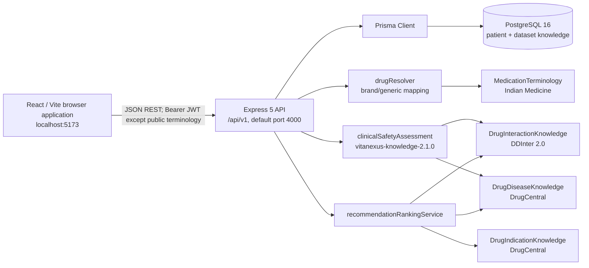
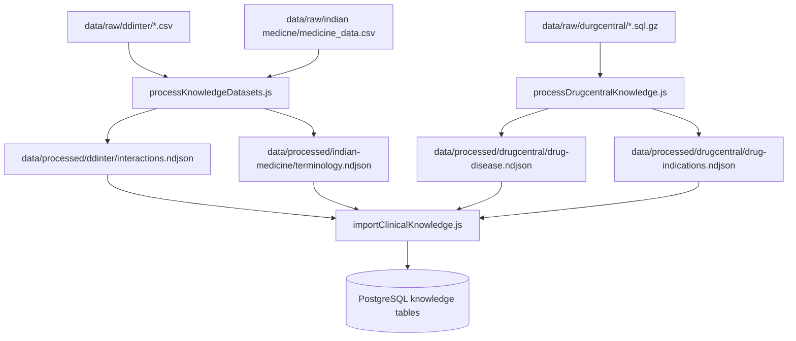

# VitaNexus-RX — Current System Architecture and Dataset Runtime Guide

**Status:** authoritative implementation reference  
**Last verified:** 2026-08-15  
**Applies to:** React UI, Express API, Prisma/PostgreSQL, local dataset pipeline, and persisted result snapshots.  
**Supersedes:** conflicting “prototype”, “static four-rule”, browser-local-storage, and `DEMONSTRATION_ONLY` runtime descriptions in the older frontend/backend specifications. Those documents are retained as historical design material only.

## 1. What the application does now

VitaNexus-RX is a clinician-authenticated React/Express/PostgreSQL application. It stores patient and consultation data in PostgreSQL, resolves Indian medicine brand names to generic ingredients, and persists dataset-backed clinical review snapshots.

The active dataset workflow has three independent evidence roles:

| Source | Used for | Stored result values | Not used for |
|---|---|---|---|
| Indian Medicine Dataset | Brand/product → generic terminology mapping | entered name, selected brand, generic, mapping source/version | DDI severity or disease assessment |
| DDInter 2.0 | Pairwise drug–drug interaction lookup | `MAJOR`, `MODERATE`, `MINOR` | probabilities, doses, multi-patient prediction |
| DrugCentral | Drug–disease relationship evidence and indication candidates | disease `HIGH`, `MODERATE`, `LOW`; candidate provenance | a probability or a validated prescription recommendation |

The active dataset workflow intentionally does **not** use the ADR/ML route or FAERS data. Those code boundaries may still exist for separate future work, but clinical safety and candidate evaluation in the normal UI flow are DDInter + DrugCentral only.

No result is prescribing advice. A dataset match is source evidence for clinician review; a no-match is not evidence of safety.

## 2. Runtime topology



The UI never reads raw dataset files. Raw data is processed offline, imported into dataset-specific PostgreSQL tables, then queried by the API. Patient data is never written into `data/raw/` or `data/processed/`.

## 3. Frontend behavior

### 3.1 Routes and providers

| Route | Page | Access | Main responsibility |
|---|---|---|---|
| `/` | `Landing` | public-only | entry point |
| `/register`, `/login` | `Register`, `Login` | public-only | account creation/sign-in |
| `/dashboard` | `Dashboard` | authenticated | patient list/entry |
| `/patients/new` | `NewPatient` | authenticated | create a patient or a consultation for an existing patient |
| `/patients/:patientId` | `PatientRecord` | authenticated | timeline, dataset results, recommendations, notes, follow-up |

`App.jsx` composes `AuthProvider`, `PatientProvider`, and `ThemeProvider`. `ProtectedRoute` uses the authenticated clinician state; it is a UI guard only. The API remains the authorization authority.

### 3.2 Authentication and API client

`src/lib/api.js` uses `VITE_API_BASE_URL` or `/api/v1`. The access token is stored in browser `localStorage` under `vitanexus_access_token`. Requests attach `Authorization: Bearer <token>` except read-only `/terminology/*` lookups. A 401 clears the local token and dispatches `vitanexus-auth-invalid`; `AuthProvider` clears the in-memory clinician.

The API helper expects the envelope `{ data, requestId }`, returns `data`, and turns failed responses into UI-safe errors. Network failure is reported as an API/database availability issue rather than silently falling back to mock data.

### 3.3 Intake and terminology lookup

`NewPatient.jsx` uses dataset lookup hooks while the clinician types:

| UI field | Endpoint | Backing table | What selection stores |
|---|---|---|---|
| Current medication / prescribed product | `GET /terminology/medications?q=&limit=` | `MedicationTerminology` | brand, generic, mapping source/version |
| Treatment indication | `GET /terminology/indications?q=&limit=` | `DrugIndicationKnowledge` | DrugCentral indication text/source/version |
| Existing condition | `GET /terminology/conditions?q=&limit=` | `DrugDiseaseKnowledge` | DrugCentral disease text/source/version |

Free text remains permitted. It is stored and evaluated as entered, but only an exact normalized dataset relationship can match it. Choosing a suggestion maximizes matchability.

On submit, `PatientProvider` performs this sequence:

1. `POST /patients` creates demographics, conditions, allergies, and active medicines.
2. `POST /patients/:id/consultations` creates the proposed prescription/visit.
3. `POST /consultations/:id/clinical-safety-assessment` persists DDInter/DrugCentral safety evidence.
4. `POST /consultations/:id/recommendations` persists DrugCentral candidates and their dataset-only checks.
5. The provider refreshes the patient list and details from the API. No durable patient/visit data is browser-local.

### 3.4 Result screen semantics

`PatientRecord.jsx` displays Clinical Safety, Recommendations, Follow-up, and Follow-up Recommendation. The ADR/ML screen is not part of the active dataset workflow.

| Displayed result | Meaning |
|---|---|
| `MAJOR`, `MODERATE`, `MINOR` | A matching DDInter record was found. |
| `HIGH`, `MODERATE`, `LOW` | A matching DrugCentral drug–disease relationship was found. |
| `NO MATCH FOUND` | Evaluation completed, but the dataset contains no record for the exact normalized terms compared. It is not a database-import error and not a “safe” finding. |

The **Why?** disclosure uses saved explanation text. For unmatched DDIs it identifies the actual DDInter terms searched. Example: Crocin is stored as Paracetamol but searched as the DDInter synonym Acetaminophen. A Crocin/Paracetamol + Dolutegravir consultation legitimately remains no-match if DDInter lacks that pair; Crocin/Paracetamol + Warfarin yields the recorded `MODERATE` pair.

## 4. Backend request, authorization, and persistence model

### 4.1 HTTP and security boundary

`server/app.js` configures request IDs, Helmet, CORS, a 1 MB JSON body limit, Morgan logging, JWT authentication, Zod validation, ownership checks, audit logging, structured errors, and `/api/v1` routes. Passwords are bcrypt hashes; JWTs carry the clinician id as `sub` and default to 15 minutes.

Every patient/consultation route loads data with the authenticated `clinicianId` and excludes soft-deleted patients. An inaccessible record responds as 404 to avoid disclosing ownership information.

### 4.2 Core persistence tables

| Model | Purpose | Key implementation details |
|---|---|---|
| `Clinician` | authenticated owner | unique email; bcrypt hash; owns patients and consultations |
| `Patient` | demographic root | `publicId` is display-safe; `deletedAt` implements soft delete; `version` supports optimistic writes |
| `PatientMedication` | medication history | entered, brand, generic, normalized name, mapping source/version, status |
| `PatientCondition`, `PatientAllergy` | clinician-recorded context | active condition filters; allergies are displayed/persisted but excluded from automated dataset calculations |
| `Consultation` | proposed drug + indication visit | keeps entered/brand/generic mapping provenance and lifecycle status |
| `ClinicalAnalysis` | immutable-by-engine-version safety snapshot | unique `(consultationId, type, engineVersion)`; `result` is JSON |
| `RecommendationSet` | candidate evaluation snapshot | unique `(consultationId, engineVersion, inputHash)`; `recommendations` is JSON |
| `AdrPrediction`, `FollowUp`, `DoctorNote`, `IntakeDraft`, `AuditEvent` | separate workflow/support records | ADR is outside the active dataset workflow; follow-up marks a consultation completed |

Dataset tables are described in Section 6. They have no foreign keys to a patient; they are shared clinical-reference data only.

### 4.3 Snapshot and cache behavior

Clinical safety is recalculated and upserted under `ENGINE_VERSION = vitanexus-knowledge-2.2.0`. Recommendation output is keyed by its engine version and a SHA-256 hash of the consultation, active medicines, active conditions, and source safety snapshot. Allergies, FAERS data, and ADR/ML values are intentionally absent from the recommendation hash.

A newer engine version creates a new snapshot rather than mutating an older version. The API response projects the newest included safety/recommendation record. Re-running a current-version endpoint updates that current-version snapshot with the same controlled input.

## 5. Medication normalization and DDInter matching

### 5.1 Resolver contract

All patient medication writes and consultation prescription writes pass through `server/services/drugResolver.js`.

1. Normalize the entered brand/generic text: lowercase, trim, punctuation → spaces, collapse whitespace.
2. Search exact `MedicationTerminology.normalizedBrand` or `normalizedGeneric`.
3. If exact lookup fails, search contains matches.
4. Store `enteredName`, selected/matched `brand`, canonical `genericName`, `normalizedName`, `mappingSource`, and `mappingVersion`.
5. If no mapping exists, retain supplied text as generic input and mark mapping source/version null.

Example: **Crocin Advance Tablet** → Indian Medicine Dataset → **Paracetamol**.

### 5.2 DDInter-specific normalization

DDInter uses ingredient strings that can differ from Indian terminology. `clinicalKnowledgeRepository.ddinterSearchTerms()` applies source-aware matching:

- Split combination medicines by `+` and `/`, evaluate ingredients individually, and de-duplicate terms.
- Map `paracetamol` and `paracetamol acetaminophen` to DDInter’s canonical term `acetaminophen`.
- Canonicalize each candidate/current-medication ingredient pair in lexical order before querying `DrugInteractionKnowledge`.
- Query all ingredient-pair combinations for a combination product and select the highest recorded severity if more than one pair matches.

This fixes the former exact-string bug where a valid Crocin/Paracetamol + Warfarin DDInter record was missed. It does **not** invent a relationship for absent pairs. For example, if DDInter has no Acetaminophen + Dolutegravir row, the result remains `NO_DATASET_MATCH`.

### 5.3 Safety evaluation algorithm

```text
candidate generic drug
  × every PatientMedication where status = ACTIVE
  → normalize/split/synonym-align DDInter ingredients
  → query DDInter pairs
  → retain every matched finding; DDI severity = highest MAJOR/MODERATE/MINOR

candidate generic drug
  × every active PatientCondition
  → normalized exact DrugCentral drug/disease lookup
  → retain every matched finding; disease assessment = highest HIGH/MODERATE/LOW

overall = HIGH if DDI MAJOR or disease HIGH
          MODERATE if DDI MODERATE or disease MODERATE
          LOW if DDI MINOR or disease LOW
          otherwise NOT_EVALUATED internally / NO MATCH FOUND in UI
```

The saved `drugDrug` result contains matched records, evaluated pairs, source/version/IDs, and human-readable explanations. `drugDisease` contains DrugCentral evidence. `overall` is an ordinal synthesis, never a probability.

## 6. Dataset pipeline and database ties

### 6.1 File-to-table flow



Raw downloads are immutable. The spelling `durgcentral` and `indian medicne` is retained because those are existing source directories.

| Command | Operation | Writes patient data? |
|---|---|---|
| `npm run data:process:core` | DDInter + Indian Medicine → NDJSON | No |
| `npm run data:process:drugcentral` | streams DrugCentral dump → disease/indication NDJSON | No |
| `npm run data:process` | both processors | No |
| `npx prisma migrate deploy` | creates/migrates tables | schema only |
| `npm run data:import` | batch `createMany(..., skipDuplicates: true)` into knowledge tables | No |
| `npm run db:seed` | invokes the knowledge import path | No patient-data seed |

`data:import` batches 500 NDJSON rows. Re-running it is idempotent for a source/version because each knowledge model has a source/version-specific unique constraint.

### 6.2 Current imported reference-data counts

Observed in the local PostgreSQL database on 2026-08-15:

| Table | Count | Source/version |
|---|---:|---|
| `MedicationTerminology` | 7,465 | Indian Medicine Dataset import 2026-08-11 |
| `DrugInteractionKnowledge` | 130,422 | DDInter 2.0 import 2026-08-11 |
| `DrugDiseaseKnowledge` | 24,507 | DrugCentral 11012023 |
| `DrugIndicationKnowledge` | 33,247 | DrugCentral 11012023 |

Counts are environment observations, not hard-coded application assumptions. Processed file row counts can be greater because PostgreSQL uniqueness constraints collapse duplicate source/version rows during import.

### 6.3 Knowledge table schemas and indexes

| Table | Identifying/lookup fields | Important constraints |
|---|---|---|
| `MedicationTerminology` | `normalizedBrand`, `normalizedGeneric` | unique `(brand, generic)` |
| `DrugInteractionKnowledge` | `normalizedDrugA`, `normalizedDrugB`, `source` | unique `(normalizedDrugA, normalizedDrugB, source, datasetVersion)`; original DDInter IDs retained |
| `DrugDiseaseKnowledge` | `normalizedDrug`, `normalizedDisease`, `source` | unique `(normalizedDrug, normalizedDisease, relationship, source, datasetVersion)` |
| `DrugIndicationKnowledge` | `normalizedIndication`, `normalizedDrug`, `source` | unique `(normalizedIndication, normalizedDrug, relationship, source, datasetVersion)` |

All four tables preserve visible source and dataset version. They must be treated as read-only from browser/API business routes; dataset updates occur through the processing/import workflow.

### 6.4 DrugCentral relationship classification

The DrugCentral processor reads `structures` to associate a `struct_id` with a canonical drug name, then reads `omop_relationship`. For disease rows it retains only transparent relationship labels:

| Relationship text matches | Stored assessment |
|---|---|
| `contraindicat` or `avoid` | `HIGH` |
| `warning`, `caution`, or `not recommended` | `MODERATE` |
| `precaution` or `monitor` | `LOW` |

Indication rows are relationship labels containing `indicat`, `treat`, `therapy`, or `used for`. Disease rows preserve DrugCentral `concept_name`, `umls_cui`, and `snomed_full_name`. Each receives `UMLS:<CUI>` when a source CUI exists, otherwise `DRUGCENTRAL:<datasetVersion>:<normalized canonical term>`; relationship, evidence, drug name, and version are retained.

### 6.5 Deterministic DrugCentral condition resolution

Drug–disease safety evaluation uses source-only, deterministic identity resolution. It never uses fuzzy, substring, inferred, or general clinical-synonym matching. A patient condition resolves only by one of these exact DrugCentral source keys: selected UMLS CUI, stored DrugCentral identity, canonical normalized name, `snomed_full_name`, or `concept_name`. If this produces one identity, the evaluator checks the proposed normalized drug against that identity. Zero or multiple identities are recorded as unresolved/ambiguous and produce no disease finding.

A resolved condition with no relationship is **NO MATCH FOUND**, not a safety claim. The condition autocomplete may use contains matching across those source fields only to help select an option; selection persists display, UMLS code when available, and `DrugCentral` provenance in `PatientCondition`. Free text remains `clinician-entered` and can match only when it exactly resolves to a unique source identity. Safety results store this provenance as `conditionResolutions` alongside the matched DrugCentral evidence.

## 7. Candidate evaluation and recommendations

1. Look up up to 25 DrugCentral drugs for the normalized consultation indication.
2. Exclude the currently proposed generic drug.
3. For every candidate, run DDInter checks against active medicines and DrugCentral checks against active conditions.
4. Derive the candidate’s ordinal assessment using the same HIGH/MODERATE/LOW/no-match synthesis as safety.
5. Sort `LOW`, `NOT_EVALUATED`, `MODERATE`, `HIGH`, then drug name; return the first three with provenance and all matched findings.

`NOT_EVALUATED` in a candidate record means no candidate-specific source relation matched. The UI renders it as **NO MATCH FOUND**. It does not mean “safe”, “approved”, or “recommended for this patient.” No ML score, FAERS data, probability, allergy check, formulary rule, dose check, laboratory value, or therapeutic substitution logic participates.

## 8. API contract relevant to data integration

| Endpoint | Authentication | Reads/writes | Result |
|---|---|---|---|
| `GET /api/v1/terminology/medications?q=&limit=` | public read-only | `MedicationTerminology` | brand/generic mapping and provenance |
| `GET /api/v1/terminology/indications?q=&limit=` | public read-only | `DrugIndicationKnowledge` | unique DrugCentral indication options |
| `GET /api/v1/terminology/conditions?q=&limit=` | public read-only | `DrugDiseaseKnowledge` | unique DrugCentral condition options |
| `POST /api/v1/consultations/:id/clinical-safety-assessment` | owner JWT | reads profile + DDInter/DrugCentral; writes `ClinicalAnalysis` | `DATASET_BACKED_WHEN_MATCHED`, findings, evidence, statuses |
| `GET /api/v1/consultations/:id/clinical-safety-assessment` | owner JWT | reads latest safety snapshot | persisted snapshot; no recalculation |
| `POST /api/v1/consultations/:id/recommendations` | owner JWT | reads profile + all three knowledge tables; writes `RecommendationSet` | `DATASET_BACKED_EVALUATION` candidates |
| `GET /api/v1/consultations/:id/recommendations` | owner JWT | reads latest set | persisted candidate snapshot |

All successful JSON responses are wrapped in `{ "data": ..., "requestId": "..." }`. API errors use `{ "error": { "code", "message", "details?" }, "requestId" }`.

### 8.1 Full application endpoint index

| Group | Endpoints | Data ownership and effect |
|---|---|---|
| Service | `GET /health`, `GET /ready` | public liveness/readiness; readiness performs a database query |
| Auth | `POST /auth/register`, `POST /auth/login`, `POST /auth/logout`, `GET /auth/me` | creates/authenticates a clinician, records relevant audit events, issues/consumes JWTs |
| Patients | `GET/POST /patients`, `GET/PATCH/DELETE /patients/:id` | authenticated clinician’s non-deleted patient records; DELETE is a soft delete |
| Profile collections | `PUT /patients/:id/conditions`, `/allergies`, `/medications` | transactionally replaces the selected collection after optional version check; medication writes call the shared resolver |
| Consultations | `POST /patients/:id/consultations`, `GET /consultations/:id`, `PATCH /consultations/:id/notes` | creates/reads an owned visit or appends a note; consultation creation resolves proposed medicine identity |
| Dataset safety | `POST/GET /consultations/:id/clinical-safety-assessment` | creates/reads the versioned `ClinicalAnalysis` snapshot described above |
| Dataset candidates | `POST/GET /consultations/:id/recommendations` | creates/reads a versioned `RecommendationSet` snapshot described above |
| ADR boundary | `POST/GET /consultations/:id/adr-predictions` | separate persisted provider boundary; not called by the active dataset workflow |
| Follow-up | `POST/GET /consultations/:id/follow-ups` | appends a clinician follow-up; POST sets consultation status to `COMPLETED` |
| Drafts | `GET/PUT/DELETE /patient-intake-drafts/:scope` | clinician-scoped form draft JSON with optimistic version checking |

The generic error handler maps Zod failures to 422, missing/invalid authentication to 401, tenant-hidden/missing resources to 404, stale optimistic writes to 409, auth-rate-limit failures to 429, and unexpected failures to a sanitized 500 response. Authentication, patient, consultation, note, analysis, recommendation, and follow-up writes use the API audit helper; intake-draft writes currently do not. Dataset table import is deliberately outside the normal browser-write route set.

## 9. Operational verification and developer workflow

```powershell
npx prisma generate
npx prisma migrate deploy
npm run data:process
npm run data:import
npm run api:test
npm run lint
npm run build
```

Use `npm run dev:api` for the API and `npm run dev` for Vite. The frontend expects `VITE_API_BASE_URL=http://127.0.0.1:4000/api/v1` in the local `.env`.

The regression suite includes a DDInter terminology-alignment test: Paracetamol/Crocin is aligned to Acetaminophen and finds the imported Acetaminophen + Warfarin `MODERATE` record. The complete local verification on 2026-08-15 passed 14 API/unit tests, ESLint, and the production Vite build.

## 10. Exact limitations and non-goals

- The datasets are coverage-limited. `NO MATCH FOUND` means the source tables do not contain the exact normalized relationship; it is not a negative clinical conclusion.
- Synonym logic currently covers the documented Paracetamol/Acetaminophen alignment and product ingredient splitting. It is not a complete clinical terminology/ontology service.
- The DDI engine checks candidate × each active medicine. It does not reason over dose, route, timing, renal/hepatic lab values, pregnancy, genotype, or higher-order interaction mechanisms.
- DrugCentral disease matching is exact normalized-text matching. Selecting a dataset condition is preferable to free text; no general synonym/ontology expansion is currently applied to conditions.
- DrugCentral indication candidates are evidence-linked options, not a validated recommendation, formulary check, or substitute order.
- Allergies are displayed and retained but deliberately excluded from all automated calculations pending an appropriate governed knowledge source.
- The ADR endpoint/provider and follow-up terms are separate legacy/future workflow components. The active DDInter/DrugCentral flow neither consumes FAERS nor invokes an ML prediction.
- This project remains a demonstration/research implementation and is not validated for clinical decision-making or production patient care.

## 11. Change log for the current dataset integration

| Date | Change |
|---|---|
| 2026-08-11/12 | Added dataset schema migration, processors, importer, Indian Medicine resolver, DDInter knowledge table, DrugCentral disease/indication tables, API terminology endpoints, dataset-backed safety persistence, and dataset-backed candidate evaluation. |
| 2026-08-13 | Removed active ML/FAERS participation from the dataset recommendation flow; changed the UI meaning of internal `NOT_EVALUATED` to visible **NO MATCH FOUND**; regenerated stored candidate evaluations. |
| 2026-08-15 | Added DDInter ingredient splitting and Paracetamol → Acetaminophen synonym alignment; added evaluated dataset terms to safety explanations; bumped the safety engine to `vitanexus-knowledge-2.1.0`; regenerated stored safety/recommendation snapshots; added Crocin/Paracetamol + Warfarin regression coverage. |
