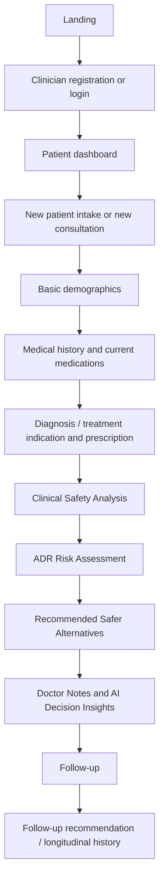
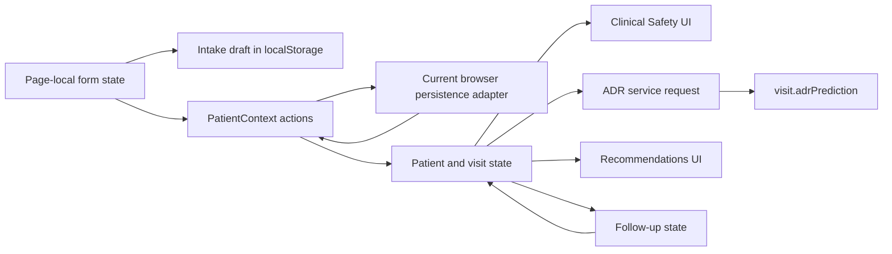
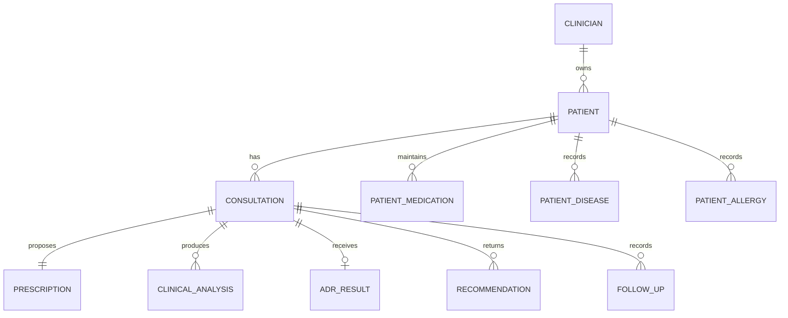
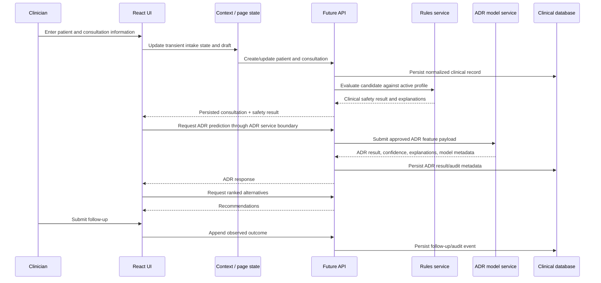

# VitaNexus-RX Frontend Architecture Specification

> **Historical frontend design record — not the current runtime contract.** The UI now uses authenticated API persistence, dataset terminology endpoints, persisted DDInter/DrugCentral results, and the Clinical Safety → Adverse Risk Assessment → Recommendations → Follow-up flow. Read [CURRENT_SYSTEM_ARCHITECTURE.md](CURRENT_SYSTEM_ARCHITECTURE.md) for the authoritative current frontend/backend contract. Assertions below about browser-local persistence, mock results, or an absent ADR stage are superseded.

**Document status:** Frontend reference for backend, database, clinical decision support (CDSS), ML, dataset, and API implementation  
**System scope:** Current React frontend, including the ADR workflow stage  
**Implementation status:** Frontend prototype with browser-local persistence and mock/placeholder clinical results

## 1. Purpose and architectural scope

VitaNexus-RX is a clinician-facing medication-safety workspace. Its purpose is to make a patient’s medication history, current consultation, rule-based clinical safety review, ADR risk prediction, treatment alternatives, and follow-up information available in one continuous workflow.

The current frontend establishes the workflow, state shapes, presentation contracts, and user interactions. It is **not** a clinical calculation engine, an ML inference service, or a production persistence layer. In particular:

- Drug-interaction, confidence, reliability, and recommendation values are currently mock or placeholder values.
- ADR presentation is separated behind an explicit service boundary, ready for a prediction API.
- Browser `localStorage` stands in for authentication, database persistence, visits, drafts, and settings.
- Explainability is a reusable presentation mechanism; its current text is templated frontend content.

The intended production architecture separates responsibilities as follows:

| Layer | Responsibility |
|---|---|
| Frontend | Collect and validate clinician input, manage workflow state, invoke APIs, render returned results, retain transient UI state. |
| Backend/application API | Authenticate users, validate and persist clinical data, orchestrate CDSS and ML calls, enforce authorization, return stable contracts. |
| CDSS/rules layer | Evaluate drug-drug, drug-disease, drug-allergy, duplicate-therapy, and regimen-level safety rules from validated clinical knowledge. |
| ML layer | Produce ADR predictions and model-generated explanatory outputs from the approved ADR input contract. |
| Datasets/knowledge services | Supply drug identity normalization, interaction knowledge, clinical vocabularies, adverse-event terminology, and model training/inference data. |
| Database/audit store | Persist users, patient records, consultations, clinical decisions, overrides, feedback, and immutable clinical/audit history. |

## 2. Architectural principles

1. **Workflow continuity.** The clinician works through patient intake, a consultation, safety assessment, ADR assessment, recommendations, notes, and follow-up without changing application context.
2. **Patient-centric longitudinal record.** A patient has a reusable clinical profile and an ordered list of visits. New consultations append to that history rather than replace it.
3. **Separation of clinical decision domains.** Clinical safety (rules), ADR prediction (ML), and alternative ranking are distinct modules with distinct future backend responsibilities.
4. **Service boundaries over UI calculations.** The ADR screen consumes a result object from a service. The browser does not calculate ADR risk.
5. **Reusable presentation.** Shared cards, badges, explainability controls, navigation shell, form controls, and animations keep the clinical workflow visually consistent.
6. **Backend replaceability.** Mock data and local persistence can be replaced without redesigning routes or page hierarchy, provided future APIs honor the documented contracts.
7. **Progressive clinical detail.** The app first captures a minimum patient profile, then consultation details, then decision support results and follow-up outcomes.

## 3. System overview and user journey

### 3.1 Detailed workflow

| Stage | Purpose | Inputs | Outputs/state update | Navigation | Future backend interaction |
|---|---|---|---|---|---|
| Landing | Explain the product and direct users to access routes. | None. | None. | Register or login. | Public configuration/content only. |
| Registration | Create a clinician account and practice profile. | Name, phone, email, gender, specialty, setting, password. | Current authenticated clinician. | Dashboard. | Create clinician account; issue secure session/token. |
| Login | Authenticate an existing clinician. | Email, password. | Current authenticated clinician. | Dashboard. | Authenticate; refresh session; enforce access control. |
| Dashboard | List clinician-owned patients and visits; create, view, edit, delete, or resume. | Search term, status filter, display mode, actions. | Local UI filter/modal state. | Patient intake or patient record. | Query patient list, retrieve summaries, delete only with authorization/audit. |
| Patient intake | Register a patient, or edit demographics/history. | Basic profile and clinical profile. | Patient profile; local intake draft while in progress. | Next intake step or dashboard. | Create/update patient and clinical history. |
| Consultation | Capture indication, candidate medicine, dose, frequency, optional notes. | Prescription and indication. | New `visit` appended to patient; candidate medication is represented in the active medication history. | Clinical Safety stage. | Create consultation/draft; normalize medication and indication. |
| Clinical Safety | Present CDSS assessment of the prescribed medicine. | Persisted patient/visit profile. | Safety result, confidence, reliability, explanations; currently placeholders/mock. | ADR stage. | Run rule-based analysis and return versioned result. |
| ADR Risk Assessment | Present ML ADR-risk prediction independently of the CDSS safety decision. | Patient ID, age, gender, active medicines excluding candidate, candidate drug. | `adrPrediction` saved on visit after a successful service response. | Back to Clinical Safety or forward to Recommendations. | Request ML prediction, persist result/model metadata, return explanation array. |
| Recommendations | Present safer alternatives and rationale. | Candidate drug, safety results, future ADR result, patient context. | Current mock recommendations; doctor notes save independently. | Follow-up. | Rank alternatives; return score, rationale, confidence, and contraindication data. |
| Follow-up | Capture observed side effect, severity, and duration. | Clinician-entered follow-up. | Visit becomes completed; updated recommendations generated in current mock layer. | Results or follow-up recommendation. | Store follow-up/adverse-event observation; rerank future recommendations. |

## 4. Project structure and responsibilities

| Area | Responsibility |
|---|---|
| `src/pages` | Route-level screens and workflow orchestration. These components own page-local state and user actions. |
| `src/components/layout` | Persistent authenticated shell: header, patient context bar, desktop visit timeline, and mobile navigation. |
| `src/components/shared` | Reusable clinician-facing inputs and presentation controls: medication chips, status badge, and explainability disclosure. |
| `src/components/ui` | Generic primitive UI, currently a confirmation dialog. |
| `src/context` | React Context state for authenticated clinician, patient/visit state, and theme preference. |
| `src/lib` | Frontend-only persistence adapter, mock result generator, explainability content, local medication/condition search helpers. |
| `src/services` | Explicit API/service boundary. ADR prediction is the first service-style integration point. |
| `src/data` | Bundled clinical-option lists, the current Indian OTC brand-to-generic reference dataset, and canonical adverse-event terms. |
| `src/assets` / `public/images` | Static visual assets for landing, registration, and login experiences. |
| `src/index.css` | Global CSS variables, Tailwind component classes, authenticated shell colors, and dedicated public/auth page visual systems. |
| Root configuration | Vite builds the SPA; Tailwind provides utility styling; PostCSS processes Tailwind; ESLint enforces browser/React quality rules. |

### 4.1 Route architecture

| Route | Access | Screen | Notes |
|---|---|---|---|
| `/` | Public only | Landing | Authenticated clinicians redirect to dashboard. |
| `/register` | Public only | Register | Creates clinician session in current prototype. |
| `/login` | Public only | Login | Authenticated clinicians redirect to dashboard. |
| `/dashboard` | Protected | Dashboard | Lists only patients owned by the current clinician. |
| `/patients/new` | Protected | NewPatient | Supports new patient, new consultation for existing patient, and patient-edit modes through route state. |
| `/patients/:patientId` | Protected | PatientRecord | Visit workspace; resolves selected/active visit and internal workflow stage. |
| `*` | Any | Redirect | Sends unknown routes to landing. |

`ProtectedRoute` is the route gate. `AppLayout` wraps protected pages, provides the top header and adaptive navigation, and renders page content through the router outlet. A patient-specific context bar appears only on the patient record route.

## 5. Page-by-page architecture

### 5.1 Landing

The landing page is a public product-introduction surface. It provides no patient data functions. Its responsibility is to route a new clinician to registration or an existing clinician to login. Its dedicated imagery and CSS are intentionally independent of the authenticated application shell.

**Backend implications:** public content/version endpoint is optional; no clinical entity is created.

### 5.2 Registration and Login

Registration collects a clinician profile. Login identifies an existing clinician. Both own temporary form and error states, delegate identity changes to `AuthContext`, and redirect to the dashboard on success.

The prototype stores passwords in browser storage. This must be replaced completely by a backend identity provider or secure authentication service. Passwords must never be stored, transmitted, or returned in plaintext in production.

**Required backend entities:** clinician account, practice/profile attributes, credential identity, session/refresh token, audit log.

### 5.3 Dashboard

The dashboard is the patient-management entry point. It calculates summary counts from loaded patient/visit data, filters by name/ID and active/completed status, supports table/card presentation, and exposes view, edit, delete, continue, and add-patient actions.

The record modal is a read-only snapshot of demographics, diseases, allergies, and medications. Deletion uses a reusable confirmation dialog. The dashboard should eventually receive a paginated patient-summary response rather than loading all full patient records into the browser.

**Backend implications:** patient list/search API, summary aggregation, authorization by clinician/practice, deletion policy (prefer soft delete or archived status), audit event for destructive action.

### 5.4 NewPatient: intake, medical history, and consultation

This is a three-step stateful workflow.

1. **Basic Details:** name, age, gender.
2. **Medical History:** diseases with duration, allergies with severity, and current medications with dose/frequency/status.
3. **Current Consultation:** standardized treatment indication, candidate medicine, mandatory dosage/frequency, and optional doctor notes.

The same page supports three modes:

- New patient: all three steps; creates patient and first visit.
- Existing patient/new consultation: begins at consultation step; carries the patient’s assembled medication history forward.
- Edit patient: edits demographics and clinical profile without creating a visit.

#### Indian OTC brand mapping integration

The current frontend already uses the bundled Indian OTC mapping at both required medication-entry points:

1. **Medical History / Current Medication:** `CurrentMedicationList` searches the mapping while the clinician adds a patient’s existing medicines. Selecting a result saves both brand and mapped generic identity in the medication-history record.
2. **New Consultation / Prescribed Drug:** `PrescribedDrug` searches the same mapping while the clinician selects the newly prescribed candidate medicine. The selected brand and generic identity are saved in the consultation prescription.

Both controls use the centralized `searchBrand` helper, which searches `src/data/otcBrands.json` by either brand or generic name and returns a bounded list of matches. The current data includes Indian OTC examples such as Crocin, Dolo 650, Combiflam, Digene, Gelusil, ENO, Benadryl, Vicks Action 500, and Saridon. This is therefore an existing frontend capability, not a missing UI feature.

For the future dataset integration, replace the bundled JSON behind the same helper/service boundary with a versioned backend terminology endpoint. The response should retain brand, generic/ingredient, product/formulation, source, and mapping-version fields. Both existing UI locations can then use the backend dataset without a workflow redesign.

An intake draft is saved automatically in browser storage after state changes. Medication and condition autocomplete currently use bundled data. The final save validates the candidate medicine, indication, dosage, and frequency before creating/appending a visit and navigating to its result workflow.

**Backend implications:** save drafts server-side or locally with user ownership; medication normalization; value-set lookup; patient create/update; consultation create; optimistic concurrency for edits; validation error contract.

### 5.5 PatientRecord: longitudinal visit workspace

PatientRecord is the primary clinical workspace. It resolves the patient by route parameter and the active visit from `PatientContext`. The desktop sidebar and mobile bottom navigation select a visit. The page contains internal stages:

1. Clinical Safety
2. ADR Risk Assessment
3. Recommendations
4. Follow-up
5. Follow-up Recommendation

The stage navigator enables stages already reached in the current workflow. Completed historical visits expose their completed stages. The workspace is animated between stages but does not change its patient route, preserving consultation context.

### 5.6 Clinical Safety Analysis stage

This stage is a presentation of a future CDSS result. It displays four stacked assessment sections:

- **Drug-Drug Analysis:** interaction risk, severity, confidence, reliability, confidence interval, and explanation toggle.
- **Drug-Disease Analysis:** currently a static placeholder interaction-risk display with centralized explanation content.
- **Drug-Allergy Analysis:** currently a static placeholder interaction-risk display with centralized explanation content.
- **Overall Clinical Risk:** a visually emphasized summary with overall risk and confidence.

The separate **Conformal Reliability** card presents the confidence interval bar and reliability label. It is the primary interval visualization.

Current drug-drug risk/confidence/reliability fields are generated by `mockEngine`; drug-disease and drug-allergy values are explicitly static placeholders. No value is clinically valid for care use until supplied by validated backend services and knowledge sources.

### 5.7 ADR Risk Assessment stage

This stage is intentionally separate from clinical safety. Clinical Safety asks whether the candidate medicine is acceptable against safety rules; ADR asks for an ML-estimated probability of an adverse drug reaction for the patient context.

The screen owns a dedicated prediction lifecycle: `loading`, `success`, `failed`, or `unavailable`. It exposes Retry for failed/unavailable states. A success result shows the most prominent predicted-risk metric, risk category badge, prediction confidence, confidence interval, and reusable explanation toggle.

The page requests data only through `adrPredictionService`. The service currently returns a placeholder response. A successful response is saved into the visit as `adrPrediction`, independently of DDI results, recommendations, notes, and follow-up.

**ADR request input contract:** patient ID, age, gender, active current medications, and candidate drug. Diseases are deliberately excluded; they belong to the preceding drug-disease rule analysis.

**ADR response contract:** predicted ADR risk percentage, category, confidence, interval bounds, status, explanations. Future additions can include most likely event, monitoring suggestions, model version, timestamp, inference duration, calibration information, and feature importance without changing the stage hierarchy.

### 5.8 Recommendations, notes, and AI Decision Insights stage

The recommendation card lists currently mock-ranked alternatives with severity, interaction risk, prediction confidence, reliability, drug-disease/allergy placeholder risks, interval, and rank explanation. The Doctor Notes field persists on blur. AI Decision Insights provides collapsible explanations for prediction, confidence, reliability, alternative ranking, and feedback learning.

The current recommendation values are not clinical recommendations. A future ranker must integrate approved alternatives, rule-based exclusions, DDI/CDSS outcomes, ADR result, patient suitability, and clinician feedback.

### 5.9 Follow-up and updated recommendation stages

The follow-up stage records an observed side effect, severity, and duration. Existing completed visits display immutable historical feedback and can append further follow-ups. New feedback completes an in-progress visit and triggers the current mock recommendation update. Standardized adverse-event suggestions originate from `sideEffects.js` to prepare future DrugBank/FAERS-compatible storage.

**Backend implications:** follow-up must be append-only or auditable; follow-up event terminology should use a controlled vocabulary; completion state must be transacted with all derived recommendation updates.

## 6. Reusable components

| Component | Why it exists / responsibility | Inputs and events | State/dependencies | Used by |
|---|---|---|---|---|
| `AppLayout` | Provides one stable authenticated shell. | Router outlet. | Router route match. | All protected routes. |
| `Header` | Gives clinician identity, theme, and logout controls a consistent location. | Logout and theme-toggle events. | Auth and theme contexts. | Authenticated shell. |
| `Sidebar` | Desktop visit timeline and dashboard exit. | Visit-select action. | Patient context, route params. | Patient record / shell. |
| `BottomNav` | Mobile equivalent of visit navigation. | Visit-select action. | Patient context, route params. | Authenticated shell. |
| `PatientContextBar` | Keeps selected patient identity visible while reviewing a record. | None. | Patient context, route params. | Patient record. |
| `ExplainToggle` | Standardizes expandable explanation disclosure without duplicating animation/accessibility behavior. | `reasons`, optional label; click toggles disclosure. | Local open/closed state; Framer Motion. | Intake medication selection, safety, ADR, recommendations, insights, feedback. |
| `StatusBadge` | Displays patient/visit status consistently. | Status and optional class override. | No local state. | Dashboard, context bar. |
| `ChipInput` | Provides reusable OTC medication lookup and removable selection chips. | Items, change callback, optional placeholder. | Search query; OTC lookup. | Available for medication-selection forms. |
| `AlertDialog` | Reusable confirmation for destructive operations. | Open state, title/description, cancel/confirm callbacks. | Controlled by parent. | Dashboard deletion. |
| Intake `ConditionPanel` | Reuses disease/allergy capture behavior while varying detail field semantics. | Condition lists, kind, entries, change callback. | Add/search/dropdown UI state. | NewPatient medical history. |
| Intake `CurrentMedicationList` | Encapsulates medication entry, duplication prevention, status selection, and editing. | Medication items and change callback. | Search, candidate, warning, editor state. | NewPatient. |
| Intake `IndicationAutocomplete` | Ensures selection from the treatment-indication vocabulary. | Current value/options/change callback. | Query/open state. | NewPatient consultation. |

## 7. State management and state flow

### 7.1 Shared contexts

| Context | Origin | Modified by | Consumed by | Production destination |
|---|---|---|---|---|
| `AuthContext` | Stored current clinician at startup. | Register, login, logout. | Route guard, header, patient provider, public pages. | Auth API/session; clinician table/profile. |
| `PatientContext` | Loads patients scoped to current clinician. | Intake creation/edit, visit append, notes, ADR save, feedback, deletion, active-visit selection. | Dashboard, navigation, NewPatient, PatientRecord. | Patient/consultation APIs and normalized database. |
| `ThemeContext` | Reads persisted theme preference. | Header toggle. | Header and root document class. | Optional user-preference API; otherwise browser preference. |

### 7.2 Temporary local state

- Registration/login forms and validation errors.
- Dashboard query, filter, view mode, selected modal record, delete confirmation.
- NewPatient basic/clinical/consultation form states, intake step, autocomplete/search controls, medication editor, profile completeness.
- PatientRecord active internal stage, visited-stage availability, Doctor Notes textarea, follow-up form, ADR loading/error/result presentation.
- ExplainToggle expansion state.

Page-local state should generally remain client-side. Any data that affects a patient’s medical or consultation record must become server-persisted through a Patient/Consultation API.

## 8. User input inventory

| Area / field | Type and validation | Required | Current storage | Future use |
|---|---|---:|---|---|
| Clinician full name | Text; registration restricts to letters, spaces, periods, apostrophes, hyphens. | Yes | Doctor record. | Account/profile; audit actor. |
| Phone | Numeric text, 7–15 digits. | Yes | Doctor record. | Clinician contact/profile. |
| Professional email | Email input; unique case-insensitively in prototype. | Yes | Doctor record. | Login identity, notifications. |
| Clinician gender/specialty/practice setting | Enumerated selects. | Yes | Doctor record. | Profile, authorization/personalization; not clinical model input by default. |
| Password / confirmation | 8+ characters with letter, number, special character; must match. | Yes | Unsafe prototype local record. | Secure credential system only; never clinical data. |
| Patient name | Text. | Yes for new patient. | Patient profile. | Patient identity. |
| Patient age | Numeric input, converted to number at save. | Yes for new patient. | Patient profile. | ADR model input; clinical demographics. |
| Patient gender | Select. | Yes for new patient. | Patient profile. | ADR model input if model design approves. |
| Disease name | Checkbox/lookup/custom text. | Optional. | Patient clinical profile. | CDSS drug-disease input; history. |
| Disease duration | Text. | Optional when disease selected. | Disease entry. | Clinical context; future rule/model use only with approval. |
| Allergy name | Checkbox/lookup/custom text. | Optional. | Patient clinical profile. | CDSS drug-allergy input. |
| Allergy severity | Mild/Moderate/Severe. | Required when allergy selected. | Allergy entry. | CDSS alert context. |
| Current medication identity | Brand/generic lookup or free text; duplicate prevention. | Optional. | Medication profile. | Active-regimen DDI and ADR input. |
| Medication dosage/frequency | Text; editable. | Optional for history. | Medication entry. | CDSS context and future ML/ranking input. |
| Medication active status | Active/Completed/Discontinued. | Required by UI default. | Medication entry. | Determines active regimen in backend/CDSS. |
| Candidate medicine | Brand lookup with generic mapping. | Yes to save consultation. | Visit prescription. | CDSS and ADR candidate input. |
| Candidate dosage | Free text. | Yes to save consultation. | Visit prescription. | CDSS/rule context; prescription record. |
| Candidate frequency | Coded input: `1d`, `2d`, `3d`, `1w`, `2w`, `3w`. | Yes to save consultation. | Visit prescription. | Prescription schedule; validation needed server-side. |
| Diagnosis/treatment indication | Autocomplete from standardized list. | Yes to save consultation. | Visit diagnosis/indication. | Consultation record; therapeutic intent; ranking context. |
| Doctor notes | Free text. | Optional. | Visit notes, saved on blur. | Clinical note/audit record; access-controlled. |
| Follow-up side effect | Standardized autocomplete. | Yes to save follow-up. | Visit feedback/follow-up. | ADR observation; future dataset feedback loop. |
| Follow-up severity | Mild/Moderate/Severe. | Yes. | Visit feedback/follow-up. | Outcome signal. |
| Follow-up duration | Positive integer days. | Yes. | Visit feedback/follow-up. | Outcome timing. |

## 9. Core data model reconstructed from the frontend

### 9.1 Clinician

| Field group | Meaning |
|---|---|
| Identity | UUID, name, email. |
| Profile | Phone, gender, specialty, practice setting. |
| Security | Prototype retains password; production requires a credential identity reference instead. |

### 9.2 Patient

| Field | Origin and consumers |
|---|---|
| `id` | Generated patient-facing identifier such as `P-0001`; used in routes and ADR request. |
| `doctorId` | Current clinician at creation; scopes dashboard and authorization. |
| `name`, `age`, `gender` | Intake demographics; shown throughout record; age/gender feed ADR request. |
| `diseases` | Disease entries with name, duration/detail, custom marker; CDSS drug-disease input. |
| `allergies` | Allergy entries with name, severity/detail, custom marker; CDSS drug-allergy input. |
| `currentMedications` | Longitudinal medication records with identity, dose, frequency, status; source for active-regimen workflows. |
| `visits` | Ordered consultation history. |
| `createdAt` | Patient record timestamp. |

### 9.3 Consultation / visit

| Field | Origin | Used by |
|---|---|---|
| `id`, `date` | Generated when consultation begins. | Timeline, historical record. |
| `prescribedDrug` / `prescription` | Candidate medicine and dose/frequency from consultation. | Clinical Safety, ADR candidate input, recommendations. |
| `indication` / `diagnosis` | Treatment indication selection. | Workspace title, record, future ranking/clinical context. |
| `doctorNotes` | Consultation textarea and notes stage. | Clinician documentation. |
| `riskResult` | Current mock engine. | Drug-drug/overall clinical display. |
| `confidence` | Current mock engine. | Safety confidence, conformal reliability. |
| `adrPrediction` | ADR service response persisted after success. | ADR stage; future ranker. |
| `recommendations` | Current mock generator. | Alternatives stage. |
| `feedback`, `feedbackDraft`, `followUps` | Follow-up entry and draft. | Visit completion and longitudinal outcome. |
| `updatedRecommendations` | Current mock re-ranking result. | Follow-up recommendation stage. |
| `status` | `in-progress` or `completed`. | Dashboard, timeline, workflow availability. |

In production, aliases such as `diagnosis`/`indication` and `prescribedDrug`/`prescription` should be normalized into one canonical consultation schema while preserving migration compatibility.

## 10. Medication history and sequential consultation architecture

The patient profile maintains medication history while every visit stores the candidate prescription that initiated that consultation. When a consultation is created, the prescription is added to the patient’s medication list if it is not already present. Starting a new consultation for an existing patient assembles both persisted medication records and prior visit prescriptions, deduplicated by normalized medication name.

The current UI exposes Active, Completed, and Discontinued medication statuses. Future backend representation should preserve medication start/end dates, source, prescriber, status transitions, route, formulation, dose, schedule, and an ingredient-normalized code. The active medication list—not all historical medications—should feed new-prescription DDI and ADR requests.

Recommended database relationships:

## 11. Explainability architecture

`ExplainToggle` is the single reusable explanation presentation mechanism. A parent supplies an array of concise reasons and optional label. The component renders an accessible toggle button and an animated, collapsible list. It deliberately does not know whether reasons came from rules, ML, ranking, or clinician feedback.

Current explanation sources are centralized in `lib/explainability.js` for drug selection, DDI, drug-disease, drug-allergy, overall risk, reliability, ranking, and feedback usage. ADR consumes the `explanations` array returned by its service response.

Production design:

- CDSS API returns human-readable, clinically reviewed rule explanations with rule/knowledge-base identifiers.
- ML API returns explanation content and, where appropriate, structured feature-importance data rather than browser-authored statements.
- Recommendation API returns rank rationale and exclusion reasons.
- UI continues to pass each explanation array into `ExplainToggle`; no redesign is needed.
- Explanations should be versioned, attributable, safe for clinical display, and audit-persisted with the result that generated them.

## 12. Data flow and future API boundary

### 12.1 ADR contract

| Request field | Source | Notes |
|---|---|---|
| Patient ID | Patient route/profile | Identifies the clinical subject and enables authorization. |
| Age | Patient profile | Input only if model governance approves its use. |
| Gender | Patient profile | Input only if model governance approves its use. |
| Current active medications | Patient medication history, excluding candidate | Must be ingredient-normalized and status-filtered by backend. |
| Candidate drug | Consultation prescription | Should include normalized ingredient, dose, route, and schedule when model supports them. |

The ADR service must not silently include disease fields, because drug-disease safety is a separate CDSS concern. A future model may have a separately governed contract, but that would be a deliberate API/model-version change.

| Response field | UI responsibility | Persistence requirement |
|---|---|---|
| ADR risk percentage | Render as primary metric. | Store exact returned value. |
| Risk category | Render with existing low/moderate/high badge semantics. | Store returned category, not a browser-derived category. |
| Confidence and interval | Display without recalculation. | Store returned values and method/version. |
| Status | Drive loading/success/error/unavailable UI. | Store completed/failed inference metadata as appropriate. |
| Explanations | Pass to ExplainToggle. | Store content, source/model version, generation timestamp. |

## 13. Recommended backend endpoints

The names below are recommendations, not currently implemented routes.

| Domain | Endpoint | Purpose |
|---|---|---|
| Authentication | `POST /auth/register`, `POST /auth/login`, `POST /auth/logout`, `GET /auth/me` | Secure clinician identity and session lifecycle. |
| Patients | `GET /patients`, `POST /patients`, `GET /patients/{id}`, `PATCH /patients/{id}`, `DELETE /patients/{id}` | Patient list/search and authorized lifecycle. |
| Clinical profile | `PUT /patients/{id}/conditions`, `PUT /patients/{id}/allergies`, `PUT /patients/{id}/medications` | Replace/version patient profile collections or use granular child endpoints. |
| Terminology | `GET /terminology/medications`, `GET /terminology/indications`, `GET /terminology/conditions`, `GET /terminology/adverse-events` | Server-owned, versioned lookup and normalization. |
| Consultations | `POST /patients/{id}/consultations`, `GET /consultations/{id}`, `PATCH /consultations/{id}/notes` | Create/read consultation and save notes. |
| Clinical safety | `POST /consultations/{id}/clinical-safety-assessment` | Trigger/read versioned DDI, disease, allergy, overall and reliability results. |
| ADR | `POST /consultations/{id}/adr-predictions`, `GET /consultations/{id}/adr-prediction` | Create/read ADR prediction. |
| Recommendations | `POST /consultations/{id}/recommendations`, `GET /consultations/{id}/recommendations` | Produce/read ranked alternatives. |
| Follow-up | `POST /consultations/{id}/follow-ups`, `GET /consultations/{id}/follow-ups` | Append outcome observations and retrieve history. |
| Drafts | `PUT /patient-intake-drafts/{scope}`, `GET /patient-intake-drafts/{scope}`, `DELETE /patient-intake-drafts/{scope}` | Optional cross-device draft persistence. |

All endpoints need authenticated clinician identity, patient/consultation ownership checks, input validation, structured error responses, request IDs, audit logging, and concurrency/version handling. Clinical-result creation should be idempotent for a known consultation/version to avoid duplicate model or rule executions.

## 14. Database planning

| Entity | Key fields / relationships | Persistence requirements |
|---|---|---|
| Clinician | User ID, email, profile, credential identity. | Unique email, secure credential separation, audit actor. |
| Patient | Patient ID, owner/practice, demographics, timestamps. | Encrypt/protect PHI; ownership scope; soft-delete policy. |
| PatientDisease | Patient, standardized condition code/display, duration, source, active status. | Version/history rather than destructive overwrite. |
| PatientAllergy | Patient, allergen code/display, severity, reaction details, source. | High-safety record; provenance and reconciliation required. |
| PatientMedication | Patient, normalized ingredient/product, dose, frequency, route, status, start/end, source. | Medication reconciliation history and active-state index. |
| Consultation | Patient, clinician, indication, status, timestamps, notes, version. | Immutable creation/auditable amendments. |
| Prescription | Consultation, product/ingredient, dose, frequency, route, duration. | Candidate drug must retain terminology identifiers. |
| ClinicalAnalysisResult | Consultation, analysis type, score/category, confidence, interval, reliability, explanations, engine/knowledge version. | Store raw response and normalized display fields; audit overrides. |
| ADRResult | Consultation, model input snapshot/hash, risk, category, confidence, interval, explanations, model/version/timestamp. | Reproducibility, model governance, inference audit. |
| Recommendation | Consultation, candidate alternative, rank, score components, exclusions, confidence, explanations. | Preserve generated ranking version; do not recompute historical record invisibly. |
| DoctorNote | Consultation, author, text, amended timestamp/version. | Access controls and audit trail. |
| FollowUp | Consultation, event term code/display, severity, duration, date, author. | Append-only outcome history; terminology provenance. |
| AuditEvent | Actor, entity, action, timestamp, request ID, before/after metadata. | Required for clinical and privacy accountability. |

## 15. Placeholder versus production data

| Current source | Current role | Production replacement |
|---|---|---|
| `localStorage` storage adapter | Local doctors, patients, visits, drafts, theme. | Authenticated API plus encrypted transactional database. |
| `mockEngine` | Random risk/confidence and random alternatives; feedback-adjusted mock recommendations. | CDSS, uncertainty/reliability service, and recommendation engine. |
| Drug-disease/allergy UI values | Static percentages. | Rule-based CDSS result specific to patient/candidate. |
| `explainability.js` | Template explanations. | CDSS/ML/ranking explanation payloads, optionally with approved fallback text. |
| ADR service response | Fixed placeholder prediction object. | ML inference API. |
| OTC JSON / option arrays | Bundled lookup lists. | Versioned terminology/clinical knowledge services and synchronized datasets. |
| Side-effect list | Local canonical suggestion list. | Controlled adverse-event terminology fed from approved source(s). |
| Images and CSS | Frontend presentation. | Remains frontend/static asset concern. |

## 16. Future dataset and knowledge integration

| Dataset/knowledge source category | Purpose | Backend service responsibility | Frontend impact | Database impact |
|---|---|---|---|---|
| Indian OTC brand-to-generic mapping and medication terminology | Normalize Indian OTC brand names, generic/ingredient, route/form. The current JSON is already used by both Medical History current-medication entry and New Consultation prescribed-drug entry. | Search, validation, canonical mapping, versioning. | Both existing lookup controls consume API results through the shared brand-search boundary. | Store canonical codes, source, mapping version, and product/formulation identifiers. |
| Drug-interaction knowledge base | DDI severity, evidence, mechanisms, management. | Pair/regimen rule evaluation and explanation. | Replace mock safety result only. | Store rule IDs, knowledge-base version, result snapshot. |
| Disease/allergy knowledge | Contraindication and precaution rules. | Patient-specific safety evaluation. | Replace placeholders. | Store codes and rule findings. |
| Adverse-event terminology / pharmacovigilance data | Normalize observed side effects and support ADR model outcome labels. | Serve controlled vocabulary, ingest/update source data. | Autocomplete may query API. | Store event codes/source versions. |
| ADR model training/inference data | Train and execute governed ADR prediction. | Feature preparation, inference, drift/calibration management. | ADR service contract remains stable. | Model registry, inference metadata, training lineage. |
| Therapeutic alternatives/formulary data | Identify permissible substitutes. | Candidate-generation and availability checks. | Recommendation display consumes return payload. | Formulary/therapeutic-class versioning. |

## 17. Machine-learning and CDSS boundary

| Responsibility | Frontend | Backend | CDSS | ML | Dataset layer |
|---|---:|---:|---:|---:|---:|
| Input capture and basic UX validation | Yes | Validates again | No | No | No |
| Patient authorization/record ownership | No | Yes | No | No | No |
| Drug identity normalization | Display only | Orchestrates | Uses normalized identity | Uses governed features | Supplies mappings |
| DDI/disease/allergy evaluation | Renders only | Orchestrates/persists | Yes | No | Supplies evidence/rules |
| ADR probability | Renders only | Orchestrates/persists | No | Yes | Supplies governed inputs/training data |
| Alternative generation/ranking | Renders only | Orchestrates/persists | Safety exclusion inputs | Optional ADR input | Formulary/rule data |
| Explainability text | Displays only | Validates/version-controls | Rule reasons | Model reasons | Evidence/provenance |

This separation is essential: a browser must not make clinical determinations, transform raw user text into ungoverned model features, or calculate a risk category from a probability. Backend contracts should return clinically displayable, versioned output.

## 18. Dependency analysis

- **Routing dependency:** all clinical screens rely on `AuthContext` through the protected route. PatientRecord additionally relies on a valid patient route ID and active visit selection.
- **Patient dependency:** Dashboard, navigation, NewPatient, and PatientRecord depend on `PatientContext`; future data fetching should preserve its stable action interface.
- **Terminology dependency:** NewPatient medication and indication controls depend on local search helpers and bundled lists. These are clear replacement points for terminology APIs.
- **Clinical-result dependency:** Clinical Safety, ADR, recommendations, and follow-up are sequentially meaningful but must be independently readable from persisted visit data.
- **ADR dependency:** ADR stage depends on a patient profile, candidate prescription, active medication set, ADR service, and persistence action. It must not depend on mock DDI data to calculate its result.
- **Recommendation dependency:** future recommendation generation should wait for both clinical safety policy results and ADR result where ranking design requires it; it must honor hard CDSS exclusions.
- **Presentation dependency:** most clinical cards depend on Tailwind `surface`, button, input, and color tokens. API changes should not require CSS changes if response contracts remain stable.

## 19. Architectural decisions and benefits

| Decision | Rationale and benefit |
|---|---|
| Context for auth/patients/theme | Keeps shared application state available without prop-drilling while the app remains small. |
| Patient with nested visits in prototype | Matches clinician mental model and simplifies local persistence; normalize to relational tables in backend. |
| Local storage adapter | Supports a functional frontend before backend implementation; all storage calls are centralized for replacement. |
| Internal patient-record stages | Preserves one patient route and patient context while moving through decision stages. |
| ADR service boundary | Prevents UI prediction logic and makes ML endpoint replacement localized. |
| Separate ADR stage | Avoids conflating deterministic clinical acceptability with probabilistic ADR prediction. |
| Centralized ExplainToggle | Lets all result types use the same accessible explanation interaction while their sources evolve independently. |
| Controlled lists plus custom markers | Balances usable prototype input with clear signals of limited analysis for nonstandard data. |
| Visit status and follow-up history | Supports longitudinal care and provides an eventual supervised feedback/audit signal. |

## 20. Backend Requirements Derived from Frontend

1. Implement secure clinician authentication, authorization, password handling, token/session lifecycle, and logout.
2. Replace browser-local persistence with clinician-scoped patient, visit, draft, notes, and follow-up APIs.
3. Enforce PHI protections, access controls, encryption, retention rules, soft deletion, and clinical audit trails.
4. Provide normalized terminology services for drugs, conditions, allergies, indications, and adverse-event terms, with source/version metadata.
5. Support patient medication reconciliation with active/completed/discontinued state, dose, schedule, route, timing, and provenance.
6. Provide versioned consultation creation/update APIs with idempotency and optimistic concurrency handling.
7. Implement CDSS orchestration for drug-drug, drug-disease, drug-allergy, duplicate/regimen-level rules, overall policy result, confidence/reliability metadata where applicable, and clinician-safe explanations.
8. Persist each clinical decision result with source knowledge version, input snapshot/hash, timestamps, rule identifiers, and override/audit capability.
9. Implement the ADR inference endpoint matching the documented input/output contract, including model version, failure/unavailable status, validation, and audit metadata.
10. Govern ADR feature use, especially demographics, with clinical, privacy, fairness, and model-validation review.
11. Implement alternative candidate generation and ranking that incorporates hard safety exclusions before ranking, with ranking rationale and confidence.
12. Ensure the ranker can consume persisted ADR results without coupling the UI to ML implementation details.
13. Implement controlled follow-up/adverse-event storage and terminology normalization; retain append-only history and link observations to consultation/prescription context.
14. Support server-side drafts if clinicians need cross-device/interrupted intake continuity.
15. Provide consistent API error envelopes, validation errors, retryable/transient failure semantics, request correlation IDs, and observability.
16. Create a data-governance process for dataset refreshes, terminology updates, clinical rule validation, model registry, calibration/drift monitoring, and historical result reproducibility.

## 21. Production readiness notes

The current frontend is an effective workflow prototype but must not be used as a source of clinical decisions until the backend/CDSS/ML layers have validated knowledge, model governance, security controls, and auditability. The visual result fields, explanations, and recommendations should be treated as contract targets—not as medically validated outputs—until the corresponding backend service is implemented and approved.

## Appendix A. Complete frontend file responsibility inventory

This appendix identifies every tracked frontend source/data/configuration file and its precise architectural responsibility. It is intentionally more granular than the high-level structure section.

| File or asset | Detailed responsibility and production implication |
|---|---|
| `index.html` | Minimal SPA host document. Declares English language, responsive viewport, browser tab title, and the single `#root` mount node. Server hosting must return this document for client-side routes such as `/patients/P-0001`. |
| `src/main.jsx` | React bootstrap boundary. Imports global CSS and mounts the application under `#root`. There is no server-side rendering or hydration. |
| `src/App.jsx` | Composition root. Creates the browser router; nests auth, patient, and theme providers; defines public-only, protected, shell, and fallback routes. Future API/client providers should be added here or immediately inside this tree. |
| `src/index.css` | Global visual contract. Defines CSS color variables, dark-mode overrides, base typography, layout classes, reusable `surface`, `input`, primary/secondary button, and eyebrow classes. It also owns isolated visual systems for landing, registration, and login screens and responsive mobile breakpoints. API work must not modify this file. |
| `src/pages/Landing.jsx` | Public product landing screen. Contains no persistent form state or patient data. Redirects an already authenticated clinician to the dashboard. |
| `src/pages/Register.jsx` | Public clinician-account creation screen. Owns registration form/error state and front-end validation. Delegates account creation to `AuthContext`. |
| `src/pages/Login.jsx` | Public authentication screen. Owns login form/error state and delegates credential matching to `AuthContext`. |
| `src/pages/Dashboard.jsx` | Clinician-scoped patient list, summary metrics, search/filter/view state, read-only record modal, and delete confirmation. It is the main entry point to create, view, continue, or edit a patient. |
| `src/pages/NewPatient.jsx` | Multi-mode intake/consultation orchestrator. It contains the principal patient/clinical data capture controls, local draft persistence, step gating, patient edit mode, new consultation mode, and final visit creation. |
| `src/pages/PatientRecord.jsx` | Patient-specific clinical workflow orchestrator. Resolves the active visit, controls internal visit stages, renders clinical safety, ADR, recommendation, notes, follow-up, and historical recommendation views. |
| `src/context/AuthContext.jsx` | Shared identity boundary. Registers/logs in/logs out clinicians in the prototype and exposes the current clinician to routing/header/patient state. |
| `src/context/PatientContext.jsx` | Shared patient/visit boundary. Owns loaded patient collection, active visit selection, mutations, local persistence refresh, and construction of new visit objects. |
| `src/context/ThemeContext.jsx` | Shared display-preference boundary. Applies/removes the `dark` class on the root document and saves only theme preference. |
| `src/components/layout/AppLayout.jsx` | Authenticated app frame. Determines whether a record-specific context bar is required and sets desktop/mobile content offsets around fixed navigation. |
| `src/components/layout/Header.jsx` | Fixed top header. Shows product identity and current clinician, toggles theme, and logs out. |
| `src/components/layout/PatientContextBar.jsx` | Fixed second header shown only for patient records. Displays patient name, patient ID, and overall active/completed status. |
| `src/components/layout/Sidebar.jsx` | Desktop-only visit timeline. Selects active visit, clears conflicting route state when a clinician manually changes visits, and returns to dashboard. |
| `src/components/layout/BottomNav.jsx` | Mobile-only analogue of visit selection. It changes active visit selection but keeps the user within the record route. |
| `src/components/shared/ExplainToggle.jsx` | Reusable, animated, accessible explanation disclosure. Limits visual output to the first four supplied reasons. This display limit is a UI constraint future APIs should account for. |
| `src/components/shared/StatusBadge.jsx` | Reusable visit/patient status display. Interprets in-progress/completed states and existing severity labels into visual status colors. |
| `src/components/shared/ChipInput.jsx` | General medication search-and-chip control powered by the OTC brand lookup. It prevents duplicate selected brands. It is available for reuse even though the richer current-medication entry component is used in the intake workflow. |
| `src/components/ui/alert-dialog.jsx` | Controlled confirmation overlay used by Dashboard before deletion. Parent owns open/close/confirm behavior. |
| `src/lib/storage.js` | Prototype persistence adapter. Encapsulates all local-storage read/write/fallback behavior, patient/doctor mutations, patient ID sequencing, theme, and intake drafts. This is the principal persistence replacement seam. |
| `src/lib/mockEngine.js` | Explicit non-production result source. Randomizes safety/reliability/recommendation fields and simulates feedback-based ranking changes. Must be removed from production decision paths. |
| `src/lib/explainability.js` | Central template-explanation provider. UI components consume these arrays through `ExplainToggle`; backend outputs should replace values, not interaction design. |
| `src/lib/otcMapping.js` | Centralized client-side mapping search. Case-insensitive brand/generic search returns at most eight matches. It is used by both medication-history and prescription entry. |
| `src/services/adrPredictionService.js` | ADR API adapter boundary. Today it returns a fixed placeholder result asynchronously. The future HTTP/API implementation belongs here, so ADR UI remains calculation-free. |
| `src/data/otcBrands.json` | Ten-entry current Indian OTC brand-to-generic reference list. It is a prototype terminology dataset, not a complete formulary or authoritative prescription database. |
| `src/data/clinicalOptions.js` | Bundled common/extended diseases and allergies, allergy severity options, and treatment-indication values. These are frontend vocabulary lists intended for eventual terminology-service replacement. |
| `src/data/sideEffects.js` | Canonical adverse-effect display terms used by follow-up datalist. The source comments designate future DrugBank/FAERS alignment. |
| `public/images/lifecare-hospital-dusk.png` | Landing background image. |
| `public/images/register-clinician-lobby.png` | Registration background image. |
| `public/images/login-clinical-lab.png` | Login background image. |
| `public/images/hospital-lobby-unsplash.jpg` | Public image asset currently available to the project; it should be catalogued/used or removed intentionally during asset governance. |
| `vite.config.js` | Enables React support for the Vite SPA build. No proxy, base URL, environment variables, aliases, API settings, or production headers are configured yet. |
| `tailwind.config.js` | Enables class-based dark mode, scans source/index files for Tailwind classes, and defines baseline semantic colors. Note that `index.css` supplies refined CSS-variable colors for the active visual system. |
| `postcss.config.js` | Runs Tailwind and Autoprefixer in CSS processing. |
| `eslint.config.js` | Applies JavaScript, browser-global, React Hook, and Vite refresh checks; ignores `dist`; permits Context exports and selected state-effect use. |
| `components.json` | shadcn-style metadata and aliases only. It does not create an API or runtime dependency by itself. |
| `package.json` | Defines React/Vite application dependencies and `dev`, `build`, `lint`, and preview commands. Runtime dependencies are React, React DOM, router, Framer Motion, and Lucide icons. |
| `.gitignore` | Excludes logs, dependencies, generated distribution outputs, local files, and editor/OS artifacts. Secrets are not explicitly named; production projects should add `.env*` handling and a committed `.env.example` policy. |
| `README.md` | Still contains the default Vite template documentation. It does not currently describe VitaNexus-RX workflows or deployment. This SAS is the authoritative architecture reference. |

## Appendix B. Internal workflow helper inventory

Several important reusable behaviors are internal to page files rather than exported components. They are still part of the runtime architecture and are documented here.

| Location / helper | Detailed behavior | Future backend or refactoring implication |
|---|---|---|
| `NewPatient.IndicationAutocomplete` | Holds query/open state; filters the provided indication list; clearing typed text clears the selected canonical value; after blur, unselected text is cleared. | API terminology search should retain the distinction between typed query and selected canonical indication. |
| `NewPatient.CurrentMedicationList` | Looks up an OTC brand/generic candidate; allows manual entry; rejects duplicate normalized names; records brand, generic, dosage, frequency, and initial `active` status; supports status changes, removal, and inline editing of dose/frequency. | Backend must validate duplicates by canonical ingredient/product, not only display text, and preserve medication status history. |
| `NewPatient.prescriptionToMedication` | Converts prior visit prescription shape into medication-history shape when assembling a subsequent consultation. | Canonical backend schema should avoid client-side shape conversion by using one medication/prescription representation with contextual links. |
| `NewPatient.getCurrentMedicationsForConsultation` | Combines persisted current medications with historical visit prescriptions; deduplicates case-insensitively by medication name. | Backend should calculate an authoritative reconciled active medication list with product/ingredient identifiers and status dates. |
| `NewPatient.ConditionPanel` | Presents common conditions as checkboxes; supports extended-list search/custom conditions; disease entries store duration, allergy entries store severity; labels custom entries as having limited AI analysis. | Terminology service should return code, display, synonym, source, and confidence; custom entries need review/reconciliation state. |
| `NewPatient.PrescribedDrug` | Performs the second required Indian OTC mapping lookup, for the candidate prescription. It stores brand and generic together and exposes generic selection explanation. | Candidate prescription must be normalized and persisted with dosage, schedule, route/formulation, and terminology code. |
| `NewPatient.isValidFrequency` | Permits only `1d`, `2d`, `3d`, `1w`, `2w`, or `3w`, ignoring whitespace. | The server must validate the same controlled schedule syntax or migrate to a structured schedule representation. |
| `NewPatient.completeness` | Displays the proportion of three nonempty profile categories: diseases, allergies, current medications. It is a UI completeness indicator, not a clinical completeness guarantee. | Do not send as clinical evidence; optional backend may calculate data-quality status independently. |
| `PatientRecord.resolveEntryStep` | Selects initial internal stage from route state and visit status: route `results` wins; route `followup` applies only to an in-progress visit; completed visits default to clinical safety; otherwise follow-up. | Any backend-driven workflow status must keep this state-machine behavior coherent or replace it explicitly. |
| `PatientRecord.RangeBar` | Draws a confidence interval as a bounded bar. It enforces a minimum visible width of two percent for presentation. | It is display-only; backend must provide valid ordered 0–100 bounds. |
| `PatientRecord.ResultCard` | Standard card wrapper with a short scale/fade entrance animation and title. | Shared visual primitive candidate if the codebase is later refactored. |
| `PatientRecord.severityFromRisk` | Converts current mock numeric risk to Low/Moderate/High for alternative displays using >30 and >60 thresholds. | This is mock presentation logic; production must receive clinically governed severity/category directly. |
| `PatientRecord.normalizeSeverity` | Translates mock Severe/Mild labels to display High/Low while preserving Contraindicated. | Avoid browser normalization in production; API should expose canonical classification and display label. |
| `PatientRecord.reliabilityFromConfidence` | Converts mock labels/percentage to High/Medium/Low for display. | Production reliability must be an explicit backend/uncertainty-service field. |
| `PatientRecord.formatDuration` | Appends `days` to numeric follow-up duration values. | Store duration with structured unit rather than infer it from text. |
| `PatientRecord.InteractionSeverityBadge` | Reuses green/amber/red visual semantics for Low/Moderate/High/Contraindicated values. | API categories must be mapped to a governed UI taxonomy. |
| `PatientRecord.Metric` | Standard label/value layout used by clinical, ADR, and recommendation results. | Pure presentation; no data mutation. |
| `PatientRecord.AdrRiskAssessment` | Dedicated ADR state machine. Builds service request from patient ID, age, gender, active medications excluding candidate by name, and candidate drug. Displays loading, failed, unavailable, and success states; persists success through PatientContext. | The exclusion should eventually use canonical IDs, not names. The service must own all risk/confidence/category computation. |
| `PatientRecord.SideEffectField` | Required datalist input bound to canonical local adverse-event terms. | Future terminology API should preserve stored event code plus display label. |
| `PatientRecord.Results` | Renders one of three internal stages: Clinical Safety, ADR, or Recommendations/Notes/Insights. It gates stage-specific content without changing patient route. | Preserve separate result domains in future API responses. |
| `PatientRecord.FollowUp` | Supports in-progress feedback submission, follow-up draft saving on each edit, historical read-only view, and further follow-up creation for completed visits. | Server needs draft semantics and append-only follow-up events. |
| `PatientRecord.UpdatedRecommendations` | Displays recommendations after feedback; historical records can navigate back to Follow-up. | Future ranker must version original and post-feedback recommendation sets. |
| `PatientRecord.WizardSteps` | Renders stage pills, disables inaccessible stages, and marks active stage for accessibility. | Stage availability may later be driven by backend consultation workflow status. |

## Appendix C. Exact local persistence contract

The prototype stores structured JSON in browser `localStorage`. These keys are not secure and must not be treated as a production schema; they reveal the current frontend persistence contract that backend migration must preserve.

| Key | Value | Write/read behavior | Replacement |
|---|---|---|---|
| `mrx_doctors` | Array of clinician records, including prototype password. | Read at registration/login; appended by registration. | Clinician/auth tables and identity provider. |
| `mrx_current_doctor` | Current clinician record or null. | Set after register/login; cleared at logout; read when AuthContext initializes. | Session cookie/token plus `GET /auth/me`. |
| `mrx_patients` | Array of all prototype patient records with nested visits. | Read/rewritten for all patient/visit updates. | Normalized transactional database/API. |
| `mrx_patient_counter` | Numeric sequence used to generate displayed IDs such as `P-0001`. | Incremented on patient creation. | Database sequence/identifier service; distinguish public display ID from primary key. |
| `mrx_theme` | `light` or `dark`. | Written when theme toggles. | Optional clinician preference. |
| `mrx_patient_intake_draft_new` | Draft for a new patient intake. | Written after relevant intake-state changes; cleared after save. | Draft endpoint or client cache with TTL. |
| `mrx_patient_intake_draft_{patientId}` | Draft for an existing patient’s consultation. | Same behavior, scoped by patient ID. | User/patient-scoped draft endpoint with concurrency/version control. |

Storage reads catch malformed/unavailable browser storage and return fallbacks. Storage writes fail silently in the prototype. Production APIs must return durable errors and not represent failed persistence as a successful clinical save.

## Appendix D. Precise navigation and workflow-state rules

### D.1 Public/authenticated behavior

- A clinician already present in AuthContext cannot remain on landing, registration, or login; those screens redirect to dashboard.
- A missing clinician cannot access dashboard, patient intake, or patient record; the route guard redirects to login.
- Header logout clears current local identity and navigates to login.

### D.2 Patient-intake behavior

- New patient begins at step 1 (Basic Details).
- Existing patient with `existingPatientId` begins at step 2 (medical history) when adding a consultation, then moves to consultation step 3.
- Patient edit mode begins at step 1 but saves after step 2; it does not create a consultation.
- Basic Details Next is disabled until name, age, and gender are nonempty.
- Consultation save is disabled until candidate medicine, indication, nonblank dosage, and valid frequency are present.
- A successful new consultation navigates to `/patients/{id}` with route state `entry: results` and the new `visitId`.

### D.3 Visit-workspace behavior

- Active visit selection is held in PatientContext; the record defaults to the active visit or latest visit if none is selected.
- A route-supplied visit ID is honored only when it matches the current active visit; explicit timeline selection clears conflicting transient route state.
- In-progress visits initially make Clinical Safety available. Continuing enables ADR; successful ADR enables Recommendations; continuing enables Follow-up; submitting feedback enables Follow-up Recommendation.
- Completed historical visits expose ADR, Recommendations, Follow-up, and Follow-up Recommendation as available stages.
- Clinical Safety continues to ADR; ADR can return to Clinical Safety and cannot continue until ADR status is successful; Recommendations continue to Follow-up.
- Dashboard Continue opens an active patient toward Follow-up; View opens a completed record without that entry hint.

### D.4 Responsive navigation

- Desktop uses a fixed 256px sidebar and a fixed top header; patient records add a patient context bar and larger top content offset.
- Mobile hides the sidebar and uses a fixed bottom visit navigation. Main content retains bottom padding to prevent overlap.
- The sidebar and bottom nav are two different controls over the same active-visit shared state.

## Appendix E. Validation, normalization, and data-quality detail

| Concern | Existing frontend behavior | Required backend strengthening |
|---|---|---|
| Clinician name | Allows only a restricted name character set during registration. | Unicode-aware name handling, trimming, identity validation appropriate to jurisdiction. |
| Clinician email | Browser email input plus local case-insensitive uniqueness. | Case-normalized unique database index, email verification, rate limiting. |
| Password | Minimum eight characters with letter, digit, special character. | Strong hashing, breach checks, reset/MFA/session policies; never persist raw value. |
| Patient age | Captured as text and converted to number on save. | Range validation and date-of-birth policy if required clinically. |
| Allergy | Severity captured but reaction type/onset/verification are absent. | Structured allergen, reaction, certainty, source, recorded date, clinician verification. |
| Disease | Name/duration captured; custom values marked. | Clinical code, status, onset, source, diagnosis confirmation, reconciliation workflow. |
| Medication | Current duplicate comparison is textual and case-insensitive. | Ingredient/product normalization, formulation, route, dose unit, duration, reconciliation and duplicate therapy logic. |
| Frequency | Six abbreviated values only. | Structured dosage schedule/time-zone-aware representation; route-specific validation. |
| Indication | Must be selected from current local list. | Standard diagnosis/indication terminology code and version. |
| Side effect | Chosen from local term list but manual free text remains technically possible. | Controlled vocabulary code, synonym resolution, seriousness/outcome fields, validation. |
| Doctor notes | Free text with no size/sanitization/version rules. | Size limits, rich-text policy, encryption/access control, amendment/audit history. |
| Clinical/ADR outputs | Frontend trusts mock/service response shape. | Schema validation, source/version metadata, clinician-safe display review, error distinction. |

## Appendix F. Detailed current data-source contents and limits

### F.1 Indian OTC mapping

The bundled mapping contains these current records:

| Indian OTC brand | Current mapped generic/ingredients |
|---|---|
| Crocin | Paracetamol (Acetaminophen) |
| Dolo 650 | Paracetamol 650mg |
| Combiflam | Ibuprofen + Paracetamol |
| Disprin | Aspirin |
| Digene | Aluminium Hydroxide + Magnesium Hydroxide + Simethicone |
| Gelusil | Aluminium Hydroxide + Magnesium Hydroxide + Simethicone |
| ENO | Sodium Bicarbonate + Citric Acid + Sodium Carbonate |
| Benadryl | Diphenhydramine |
| Vicks Action 500 | Paracetamol + Phenylephrine + Caffeine |
| Saridon | Paracetamol + Propyphenazone + Caffeine |

The lookup performs case-insensitive substring matching over both columns and returns no more than eight records. It does not include manufacturer, formulation, route, strength normalization, pack size, regulatory status, source date, NDC/RxNorm/other terminology identifier, interaction classification, or availability. A future Indian mapping dataset must add this provenance and product precision before it is used for clinical decisions.

### F.2 Local clinical vocabularies

- Common disease checkbox choices: Diabetes, Hypertension, Asthma, Kidney Disease, Liver Disease.
- Common allergy checkbox choices: Penicillin, Sulfa Drugs, Aspirin, Food Allergies.
- Extended disease and allergy lists support suggestion search and can still be supplemented by custom values.
- Allergy severity choices are Mild, Moderate, Severe.
- Treatment indication list includes acute pain, respiratory/allergy, infection, gastrointestinal, cardiovascular, neurologic, inflammatory, and diabetes examples.
- Side-effect terms include common gastrointestinal, neurological, dermatological, respiratory, cardiovascular, constitutional, sleep, appetite, weight, and injection-site outcomes.

These lists should not become uncontrolled database free text. They are migration seeds for terminology-backed APIs and require source ownership, code systems, update policies, and clinician governance.

## Appendix G. Presentation, animation, and accessibility detail

- Framer Motion animates landing/auth entrances, intake step transitions, result-card entrances, range-bar fill, saved-feedback confirmations, and patient-record stage transitions.
- `ExplainToggle` exposes `aria-expanded`; WizardSteps uses `aria-current="step"`; timeline buttons use `aria-current="page"`; icon-only actions have accessible labels where present.
- Responsive breakpoints used by application styles include mobile below 640px/480px, authenticated layout at the medium breakpoint, and public/auth layout changes around 768px/900px.
- Global page minimum width is 320px. Inputs, textareas, selects, and buttons inherit the page font.
- The authenticated shell uses fixed header/navigation. New screens must respect the content padding/top-offset behavior supplied by AppLayout.
- The visual color contract uses primary blue, accent teal, success green, warning amber, danger red, slate neutral surfaces, and class-based dark mode. Existing status semantics should be retained by future API categories.
- The landing and authentication screens deliberately use dedicated image-overlay visual systems; they are not evidence of a separate product or application module.

## Appendix H. Exact current dependency and build profile

| Package/category | Current use |
|---|---|
| React 19 / React DOM 19 | Client-rendered component runtime. |
| React Router 7 | Browser routing, route guards, nested shell outlet, navigation state and route parameters. |
| Framer Motion | Page/card/accordion/progress transition effects. |
| Lucide React | All current UI icons. |
| Vite | Development server and production bundler. |
| Tailwind CSS/PostCSS/Autoprefixer | Utility styles and compiled CSS processing. |
| ESLint + React Hook / React Refresh plugins | Source-quality and hook/development rules. |

The project is JavaScript/JSX rather than TypeScript. There are no test scripts, API clients, environment-variable files, HTTP libraries, server proxy configuration, automated database migrations, unit tests, integration tests, end-to-end tests, telemetry, error-boundary component, analytics, feature flags, or accessibility test tooling configured at present. These are all future engineering requirements, not hidden frontend features.

## Appendix I. Additional backend checklist derived from minute frontend behavior

1. Maintain a stable public patient-display identifier while using an internal immutable primary key.
2. Model patient, consultation, prescription, medication history, notes, results, and follow-up separately rather than persisting the current nested browser object unchanged.
3. Preserve original and normalized medication identity; do not lose the user-selected Indian OTC brand when mapping it to ingredients.
4. Provide a terminology-search API capable of both brand and generic substring matching, result limits/pagination, synonym matching, and source/version metadata.
5. Support manual/unmapped medication/condition entries with an explicit `unmapped` or reconciliation-required status instead of silently treating text as normalized data.
6. Return API validation errors at field level so existing forms can show targeted errors rather than only suppressing submit.
7. Persist intake drafts atomically and scope them to clinician, patient/new-patient context, and expiration policy.
8. Make visit status transitions explicit: draft, in-progress, safety-assessed, ADR-assessed, recommendations-ready, follow-up-pending, completed, amended/archived as applicable.
9. Do not infer clinical severity, reliability, category, or confidence interval in the browser. Return each from the responsible engine.
10. Keep clinical safety, ADR, and recommendation request/response records versioned independently, linked by consultation ID and input snapshot/version.
11. Support ADR failure/unavailable responses distinctly from clinical `low risk`; the current UI already treats these as different states.
12. Preserve explanation arrays in returned order and cap or paginate them intentionally, because current UI displays the first four items.
13. Record result timestamp, source engine/model/knowledge version, request correlation ID, and clinician acknowledgement/override reason for clinical safety alerts.
14. Make recommendation generation idempotent for a consultation/result version and preserve post-follow-up re-ranked results instead of overwriting initial recommendations.
15. Store follow-up duration as numeric value plus unit and side effect as controlled vocabulary code plus display text.
16. Authorize every patient/consultation/note/follow-up request by clinician/practice tenant and protect all PHI in transit and at rest.
17. Add an audit event for authentication, patient changes, medication reconciliation, clinical-result access, notes, follow-up, deletes, and overrides.
18. Provide UI-safe error messages while recording detailed server diagnostics separately; never expose ML internals, raw stack traces, or PHI in browser logs.

## Appendix J. Known prototype limitations, explicitly not hidden behavior

- The application does not currently call a real backend.
- Doctor passwords are stored in local browser storage and compared directly; this is prototype-only and unsafe.
- Patient data is browser-local and can be lost, altered, or accessed by a user of the same browser profile.
- The DDI/clinical risk values, confidence, reliability, recommendations, and feedback updates are mock-generated.
- Drug-disease, drug-allergy, and alternative disease/allergy percentages are static presentation placeholders.
- ADR output is a fixed placeholder service response, not an ML inference result.
- Clinical explanations are mostly frontend templates; they are not evidence-linked clinical explanations.
- The Indian OTC mapping is very small and does not itself establish a valid regulatory/clinical mapping service.
- The current UI does not capture route, formulation, medication start/end date, allergy reaction, disease coding, vital signs, laboratory data, renal/hepatic measures, pregnancy status, or other patient context that many production rules/models may require.
- There is no backend authorization, encryption, audit, model registry, knowledge-base versioning, dataset governance, monitoring, or incident/error reporting in the current project.
- There is no automatic save endpoint for Doctor Notes; it is persisted locally when focus leaves the field in the prototype.
- The build is an SPA and needs hosting-level route fallback for direct navigation/refresh on protected client routes.
